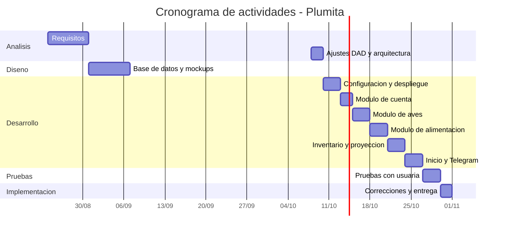
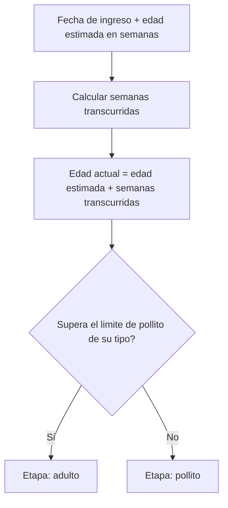
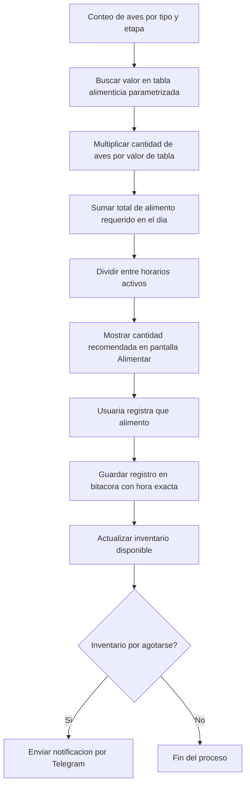
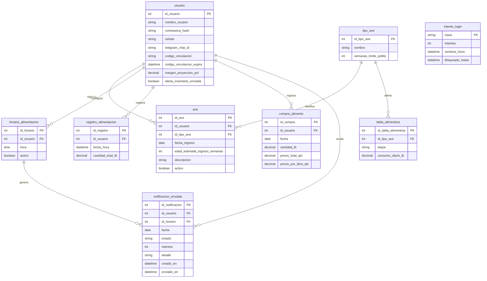

# Documento de Análisis y Diseño (DAD)

## Plumita: aplicación web para el control de alimentación en producción avícola de traspatio

**Elaborado por:** Keila Valesca Ramírez
**Carnet:** 7690-22-2239
**Revisado por:** Melvin Cali
**Curso:** Seminario de Tecnologías de Información
**Fecha:** 06/10/2026
**Versión:** 1.2

---

# CONTENIDO

**Control de versiones**

**1. Introducción**

**2. Contexto general de la solución**
&nbsp;&nbsp;&nbsp;&nbsp;**2.1. Participantes**
&nbsp;&nbsp;&nbsp;&nbsp;**2.2. Flujo funcional de Plumita**
&nbsp;&nbsp;&nbsp;&nbsp;**2.3. Alcance**
&nbsp;&nbsp;&nbsp;&nbsp;**2.4. Limitaciones**
&nbsp;&nbsp;&nbsp;&nbsp;**2.5. Cronograma de actividades**
&nbsp;&nbsp;&nbsp;&nbsp;&nbsp;&nbsp;&nbsp;&nbsp;2.5.1. Tabla de actividades
&nbsp;&nbsp;&nbsp;&nbsp;&nbsp;&nbsp;&nbsp;&nbsp;2.5.2. Diagrama de Gantt

**3. Descripción del proceso de solución**
&nbsp;&nbsp;&nbsp;&nbsp;**3.1. Requisitos funcionales (RF)**
&nbsp;&nbsp;&nbsp;&nbsp;**3.2. Requisitos no funcionales (RNF)**
&nbsp;&nbsp;&nbsp;&nbsp;**3.3. Dependencias**
&nbsp;&nbsp;&nbsp;&nbsp;**3.4. Descripción de las pantallas / unidades funcionales**
&nbsp;&nbsp;&nbsp;&nbsp;**3.5. Diagrama y descripción del proceso técnico**
&nbsp;&nbsp;&nbsp;&nbsp;&nbsp;&nbsp;&nbsp;&nbsp;3.5.1. Cálculo automático de la edad
&nbsp;&nbsp;&nbsp;&nbsp;&nbsp;&nbsp;&nbsp;&nbsp;3.5.2. Cálculo de la cantidad de alimento
&nbsp;&nbsp;&nbsp;&nbsp;&nbsp;&nbsp;&nbsp;&nbsp;3.5.3. Inventario y proyección

**4. Diseño de la base de datos**
&nbsp;&nbsp;&nbsp;&nbsp;**4.1. Estructura de tablas**
&nbsp;&nbsp;&nbsp;&nbsp;**4.2. Diagrama entidad-relación**
&nbsp;&nbsp;&nbsp;&nbsp;**4.3. Tabla alimenticia parametrizada**

**5. Test**
&nbsp;&nbsp;&nbsp;&nbsp;**5.1. Casos de prueba**

**6. Glosario**

**7. Anexos**
&nbsp;&nbsp;&nbsp;&nbsp;**7.1. Mockups de pantallas**

## Control de versiones

| Fecha | Versión | Autor | Descripción |
|---|---|---|---|
| 08/10/2026 | 1.1 | Keila Valesca Ramírez | Horarios, vinculación de Telegram, edad en semanas, cronograma y tabla alimenticia |
| 06/10/2026 | 1.2 | Keila Valesca Ramírez | Regla de omisión de recordatorios, notificacion_enviada, rate limit, registro cerrable, pantallas de horarios y Telegram, ejecución en localhost |

---

## 1. Introducción

Este documento explica cómo está pensado por dentro el sistema Plumita, una aplicación web enfocada en resolver un problema bien concreto: el control del alimento que se les da a las aves en una granja pequeña de traspatio. La idea nace de una situación real, porque quien maneja la granja lleva todo el registro de forma manual, sin ningún control exacto de cuánto alimento se compra, cuánto se consume ni cuánto cuesta mantener a las aves.

Con Plumita se busca que esa persona pueda registrar desde su celular la alimentación diaria de sus aves, sin necesidad de hacer cálculos a mano, y que el sistema le diga automáticamente cuánto darles según el tipo y la edad de cada ave. También se busca que tenga un control claro del inventario de alimento y de cuánto necesita comprar antes de que se le acabe.

Este documento describe el contexto general de la solución, los requisitos que debe cumplir, el diseño técnico detrás de cada funcionalidad y cómo está estructurada la información dentro del sistema.

## 2. Contexto general de la solución

### 2.1. Participantes

| Rol | Descripción |
|---|---|
| Usuaria final | Linda, madre de la desarrolladora y dueña de la granja avícola. Es quien registra la alimentación diaria, las compras de alimento y consulta la información del sistema desde su celular. |
| Desarrolladora | Estudiante Keila Ramírez, encargada del diseño, desarrollo y pruebas del sistema como parte de su proyecto de graduación. |
| Aves de la granja | No son usuarias del sistema, pero son el objeto central sobre el que se calcula toda la información (cantidad de alimento, edad, tipo). |

### 2.2. Flujo funcional de Plumita

Se detalla a continuación:

1. La usuaria ingresa a la aplicación desde el navegador de su celular.
2. Registra o consulta las aves que tiene activas, agrupadas por tipo (gallina, gallo, pato) y por etapa (pollito o adulto).
3. El sistema calcula la edad actual de cada ave en semanas, a partir de la fecha aproximada en que ingresó a la granja y la edad que se estimó en ese momento.
4. La usuaria define a qué horas del día alimenta a sus aves (hasta 3). A cada una de esas horas, el sistema le manda un recordatorio por Telegram con la cantidad que le toca dar, salvo que ya haya registrado una alimentación en la hora previa.
5. Cuando abre la pantalla de alimentar, el sistema le muestra la cantidad recomendada, calculada según el tipo, la etapa y la cantidad de aves que tiene.
6. La usuaria registra que ya alimentó a las aves, y ese registro queda guardado como parte del historial.
7. Cada vez que compra alimento, lo registra con la cantidad en libras y el precio pagado, y el sistema actualiza el inventario disponible.
8. Con base en el consumo, el sistema le proyecta cuánto alimento va a necesitar y cuánto le va a costar en los próximos 15 días.
9. Si el alimento está por agotarse, el sistema le envía una alerta por Telegram.

### 2.3. Alcance

El sistema Plumita cubre únicamente el módulo de control de alimentación de una granja avícola de traspatio. Dentro de este alcance se incluye:

- Registro y gestión de aves por tipo y etapa.
- Cálculo automático de la edad de cada ave en semanas.
- Cálculo de la cantidad de alimento a dar según una tabla alimenticia parametrizada.
- Registro y consulta del historial de alimentación.
- Registro de compras de alimento y control del inventario disponible.
- Proyección de cuánto alimento se necesita comprar en los próximos 15 días, junto con el costo estimado.
- Horarios de alimentación personalizables y envío de recordatorios y alertas por Telegram.
- Interfaz mobile-first, pensada para usarse desde el navegador de un celular.

### 2.4. Limitaciones

Así como se definió qué sí cubre el sistema, también es importante dejar claro qué queda fuera de este proyecto:

- No incluye otros módulos de gestión de granja como el control sanitario o el financiero general, únicamente el de alimentación.
- No calcula fórmulas nutricionales propias; usa una tabla alimenticia de referencia con valores aproximados, cargada durante el desarrollo y no editable por la usuaria.
- No pide la fecha exacta de nacimiento de las aves; trabaja con la edad estimada en semanas y la fecha aproximada de ingreso a la granja.
- No incluye recuperación de contraseña.
- Depende de conexión a internet y de que la usuaria tenga Telegram instalado.
- No se desarrolla como aplicación nativa para tiendas de aplicaciones, sino como una aplicación web accesible desde el navegador.
- No sustituye la asesoría de un médico veterinario o zootecnista.
- No tiene un nivel de disponibilidad garantizado tipo empresarial; su funcionamiento se valida durante el periodo de pruebas con la usuaria real.
- No se despliega en un servidor público durante el proyecto: la aplicación corre en Docker Compose en un equipo local y se usa desde la red local. Los recordatorios solo se envían mientras ese equipo y la aplicación estén encendidos.
- La tabla alimenticia maneja solo dos etapas (pollito y adulto), aunque un ave sigue creciendo después de la etapa pollito. El margen de la proyección ayuda a cubrir esa diferencia.

### 2.5. Cronograma de actividades

El desarrollo de Plumita sigue las etapas del ciclo de vida del software: análisis, diseño, desarrollo, pruebas e implementación. La fecha límite para tener la aplicación implementada y funcionando es el 31 de octubre.

#### 2.5.1. Tabla de actividades

| Etapa | Actividad | Fecha inicio | Fecha fin |
|---|---|---|---|
| Análisis | Definición de requisitos funcionales y no funcionales | 24/08 | 30/08 |
| Diseño | Diseño de base de datos, diagrama entidad-relación y mockups | 31/08 | 06/09 |
| Análisis | Ajustes al DAD, tabla alimenticia y arquitectura técnica | 08/10 | 09/10 |
| Desarrollo | Configuración del proyecto, base de datos, Docker Compose local, CI y backup con restauración probada | 10/10 | 12/10 |
| Desarrollo | Módulo de cuenta (registro, login, configuración) | 13/10 | 14/10 |
| Desarrollo | Módulo de aves (ingresar, editar, inactivar, edad y etapa) | 15/10 | 17/10 |
| Desarrollo | Módulo de alimentación (cálculo, registro e historial) | 18/10 | 20/10 |
| Desarrollo | Módulo de inventario y proyección a 15 días | 21/10 | 23/10 |
| Desarrollo | Pantalla de inicio y notificaciones por Telegram | 24/10 | 26/10 |
| Pruebas | Casos de prueba y pruebas con la usuaria real | 27/10 | 29/10 |
| Implementación | Corrección de observaciones y puesta en marcha final en Docker Compose | 30/10 | 31/10 |

#### 2.5.2. Diagrama de Gantt

## 3. Descripción del proceso de solución

### 3.1. Requisitos funcionales (RF)

**RF-01. Registro de usuario**
El sistema debe permitir crear una cuenta nueva solicitando usuario, contraseña y número de celular. El número de celular se guarda como dato de contacto. Las notificaciones llegan por Telegram una vez vinculada la cuenta (RF-17).

**RF-02. Inicio de sesión**
El sistema debe permitir que la usuaria inicie sesión con su usuario y contraseña.

**RF-03. Editar información de la cuenta**
Desde la pantalla de configuración, la usuaria debe poder editar su número de celular y su contraseña.

**RF-04. Ingresar ave**
El sistema debe permitir registrar una nueva ave, seleccionando el tipo (gallina, gallo o pato), la fecha aproximada de ingreso a la granja, la edad estimada en semanas que tenía en ese momento y una breve descripción.

**RF-05. Editar ave**
El sistema debe permitir editar la fecha de ingreso, la edad estimada en semanas y la descripción de un ave ya registrada.

**RF-06. Inactivar ave**
El sistema debe permitir inactivar un ave en vez de eliminarla, para conservar su historial de alimentación, y reactivarla después.

**RF-07. Configurar horarios de alimentación**
El sistema debe permitir que la usuaria defina a qué horas del día alimenta a sus aves (por ejemplo 7:00 a. m. y 4:00 p. m.), hasta un máximo de 3 horarios por usuaria, sin mínimo. No se permiten dos horarios con la misma hora. Los horarios se pueden agregar, editar, activar, desactivar y eliminar. La cantidad de horarios activos es la cantidad de veces al día que se alimenta.

**RF-08. Calcular cantidad de alimento**
El sistema debe calcular automáticamente cuánto alimento darle a las aves, tomando en cuenta la cantidad de aves según su tipo y etapa, la tabla alimenticia parametrizada y la cantidad de horarios de alimentación activos.

**RF-09. Registrar alimentación**
El sistema debe permitir registrar que se alimentó a las aves, guardando la hora del registro como parte de una bitácora. La cantidad aparece prellenada con la recomendada y la usuaria puede ajustarla si dio más o menos.

**RF-10. Ver historial de alimentación**
El sistema debe mostrar un historial con las alimentaciones registradas anteriormente.

**RF-11. Registrar compra de alimento**
El sistema debe permitir registrar una compra de alimento, ingresando la cantidad comprada en libras y el precio pagado en quetzales.

**RF-12. Ver historial de compras**
El sistema debe mostrar un historial con las compras de alimento registradas.

**RF-13. Mostrar inventario disponible**
El sistema debe mostrar cuánto alimento se tiene disponible en libras, calculado a partir de lo comprado menos lo consumido.

**RF-14. Proyectar necesidad de compra**
El sistema debe proyectar cuánto alimento se va a necesitar en los próximos 15 días y cuánto costaría esa compra, usando como base el consumo diario calculado y el precio por libra de la última compra.

**RF-15. Recordatorio de alimentación**
A cada hora configurada, el sistema debe enviar un recordatorio por Telegram con la cantidad de alimento que corresponde dar en esa toma. Si la usuaria registró una alimentación dentro de los 60 minutos previos a la hora del horario, ese recordatorio no se envía y queda en estado "omitido". El sistema envía el recordatorio solo si la hora del horario no tiene más de 10 minutos de antigüedad, y nunca envía dos veces el mismo horario en el mismo día. Si el envío falla, se reintenta hasta 3 veces dentro de esos 10 minutos.

**RF-16. Enviar notificación de inventario bajo**
El sistema debe enviar una notificación por Telegram cuando el inventario de alimento esté por agotarse.

**RF-17. Vincular Telegram**
Desde la pantalla de configuración, la usuaria debe poder vincular su cuenta de Telegram con el bot de Plumita. El sistema genera un código aleatorio de un solo uso que expira a los 10 minutos y le muestra un enlace al bot que lo incluye; ella toca "Iniciar" y la cuenta queda vinculada para recibir mensajes. Un código usado o expirado no sirve y se debe generar uno nuevo.

**RF-18. Registro de cuentas cerrable**
El sistema debe poder cerrar el registro de cuentas nuevas mediante la variable de entorno REGISTRO_ABIERTO. Abierto en desarrollo y cerrado en producción, después de crear la cuenta de la usuaria.

**RF-19. Cerrar sesión**
Desde la pantalla de configuración, la usuaria debe poder cerrar su sesión.

**RF-20. Desvincular Telegram** (prioridad baja)
Desde la pantalla de configuración, la usuaria debe poder desvincular su cuenta de Telegram.

### 3.2. Requisitos no funcionales (RNF)

**RNF-01. Diseño mobile-first**
El sistema debe estar diseñado principalmente para usarse desde el navegador de un celular, ya que es el único dispositivo que utiliza la usuaria final.

**RNF-02. Tiempo de carga**
Las pantallas principales deben cargar en menos de 2 segundos.

**RNF-03. Cálculo automático de edad**
El sistema no guarda la edad actual del ave, sino que la calcula cada vez que la necesita, sumando la edad estimada al ingresar más las semanas que han pasado desde la fecha de ingreso. Así la edad y la etapa siempre están al día sin depender de un proceso diario.

**RNF-04. Tabla alimenticia parametrizada**
El sistema debe contar con una tabla alimenticia organizada por tipo de ave y etapa (pollito o adulto). Esta tabla se carga durante el desarrollo del sistema y no puede ser editada por la usuaria.

**RNF-05. Bitácora de alimentación**
Cada registro de alimentación debe guardar la hora exacta en la que se realizó, para mantener un historial confiable.

**RNF-06. Validación de precio de compra**
Al registrar una compra, el sistema debe guardar el precio por libra pagado, ya que ese valor se usa como base para proyectar el costo de la próxima compra.

**RNF-07. Margen de error en la proyección**
La proyección a 15 días incluye un margen del 10 % por defecto, para cubrir los días en que se da un poco más de lo recomendado.

**RNF-08. Disponibilidad durante pruebas**
El sistema debe mantenerse disponible durante el periodo de pruebas con la usuaria real, sin que esto implique una garantía formal de disponibilidad a nivel empresarial.

**RNF-09. Umbral de inventario bajo**
El sistema considera que el alimento está por agotarse cuando alcanza para 3 días o menos, según el consumo diario calculado. La alerta se evalúa al registrar una alimentación, se envía una sola vez (campo alerta_inventario_enviada) y se vuelve a habilitar cuando se registra una compra.

**RNF-10. Zona horaria**
Todas las horas del sistema (horarios, recordatorios y bitácora) usan la zona horaria de Guatemala (America/Guatemala, UTC-6).

**RNF-11. Sesión y credenciales**
La contraseña se guarda con argon2id. La sesión usa una cookie firmada, httpOnly, sameSite=lax y de 30 días. El atributo secure se controla con la variable COOKIE_SECURE.

**RNF-12. Protección del inicio de sesión**
Tras 5 intentos fallidos en 15 minutos, por usuario o por dirección IP, el sistema bloquea nuevos intentos durante 15 minutos.

**RNF-13. Validación en servidor**
Todo dato recibido del cliente se valida en el servidor con zod antes de usarse.

**RNF-14. Respaldo**
La base de datos tiene un respaldo diario con una restauración probada.

**RNF-15. Accesibilidad**
La interfaz cumple WCAG AA básico: contraste de texto de 4.5:1, foco visible, etiquetas en los campos y objetivos táctiles de 44 px.

### 3.3. Dependencias

**Telegram (Bot API)**
Telegram no permite que un bot le escriba a alguien solo con su número de celular. Por eso la usuaria debe abrir el bot de Plumita desde el enlace que le da la app y tocar "Iniciar". El sistema recibe ese aviso consultando periódicamente la Bot API (long polling con getUpdates), por lo que no necesita una dirección pública. En ese momento guarda su identificador de chat y a partir de ahí ya puede mandarle recordatorios y alertas. El uso de webhook queda previsto para cuando exista un servidor público.

**Equipo anfitrión y red local**
Durante el proyecto el sistema corre en Docker Compose en un equipo local, accesible desde el celular de la usuaria por la IP de la red local. Depende de que el equipo esté encendido, sin suspensión y en la misma red. Se documenta, sin ejecutarlo, el despliegue en un VPS con proxy inverso y TLS.

### 3.4. Descripción de las pantallas / unidades funcionales

**Login**
Pantalla de entrada al sistema. Solicita usuario y contraseña. Si las credenciales son correctas, la usuaria pasa a la pantalla de inicio; si no, el sistema muestra un mensaje de error.

**Registro**
Permite crear una cuenta nueva. Solicita usuario, contraseña y número de celular. El número de celular queda guardado como dato de contacto, y el texto de ayuda de la pantalla no lo presenta como medio de aviso. Si el registro está cerrado, la pantalla lo indica y remite al inicio de sesión.

**Inicio**
Es el punto de partida después de iniciar sesión. Muestra un resumen general: cuántas aves activas se tienen, cuánto alimento hay disponible en inventario, para cuántos días alcanza ese alimento y a qué hora es la próxima alimentación con su cantidad recomendada. La tarjeta de alcance cambia a estilo de alerta cuando alcanza para 3 días o menos. Si no hay horarios activos, en lugar de la próxima alimentación se invita a configurar uno. Esta pantalla le da a la usuaria una idea rápida del estado de la granja sin tener que entrar a otra sección.

**Mis aves**
Muestra las aves en cuatro banners: Polluelos (todas las aves en etapa pollito) y Gallinas, Gallos y Patos adultos. La edad se muestra siempre en semanas. Desde aquí se puede agregar una nueva ave llenando un formulario con tipo (gallina, gallo o pato), fecha aproximada de ingreso, edad estimada en semanas en ese momento y descripción. También se puede editar, inactivar o reactivar una ave existente. El tipo no se edita.

**Alimentar**
Muestra la cantidad de alimento que corresponde dar en una toma, ya calculada por el sistema, con la etiqueta del horario: el activo más reciente que ya pasó hoy o, si ninguno ha pasado, el próximo. El horario solo cambia la etiqueta, no la cantidad. Al confirmar, la cantidad aparece prellenada y puede ajustarse. Tiene un botón para registrar que se alimentó a las aves, lo cual queda guardado en el historial con la hora exacta. Debajo se muestra el historial reciente de alimentaciones.

**Inventario**
Muestra cuánto alimento hay disponible en libras. Incluye una proyección de cuánto alimento se necesita comprar para cubrir los próximos 15 días y el costo estimado de esa compra. Tiene un botón para registrar una nueva compra (cantidad en libras y precio pagado) y muestra el historial de compras anteriores.

**Configuración**
Permite editar el número de celular y la contraseña de la cuenta, administrar los horarios de alimentación, vincular Telegram y cerrar sesión. También muestra, solo para consulta, la tabla alimenticia parametrizada por tipo de ave y etapa.

**Configuración: gestión de horarios**
Lista hasta 3 horarios, cada uno con su hora, un interruptor de activo y las acciones Editar y Eliminar. El botón "Agregar horario" abre un diálogo con un selector de hora y se deshabilita al llegar al máximo. Si la hora ya existe, muestra un error. Sin horarios activos se muestra el aviso de que hay que configurar uno.

**Configuración: vinculación de Telegram**
Muestra el estado: "Sin vincular" o "Vinculado". Con "Vincular Telegram" genera el código y muestra un botón "Abrir Telegram" con el enlace al bot y el tiempo restante de validez. Al recibir el /start, el estado cambia a "Vinculado" y llega un mensaje de bienvenida. Si el código expira, ofrece generar uno nuevo.

### 3.5. Diagrama y descripción del proceso técnico

#### 3.5.1. Cálculo automático de la edad

Cada ave guarda su fecha aproximada de ingreso y la edad estimada en semanas que tenía en ese momento. Cuando el sistema necesita saber su edad, hace esta cuenta:

> edad actual (semanas) = edad estimada al ingresar + semanas transcurridas desde la fecha de ingreso

Si la edad actual no pasa del límite de pollito de su tipo, el ave está en etapa pollito; si lo pasa, está en etapa adulto.

#### 3.5.2. Cálculo de la cantidad de alimento

Cuando llega la hora de alimentar, el sistema toma la cantidad de aves agrupadas por tipo y etapa, busca en la tabla alimenticia parametrizada cuánto le corresponde a cada grupo, y divide ese total entre la cantidad de horarios activos. El resultado es la cantidad exacta que la usuaria debe dar en ese momento.
Los recordatorios se programan con una verificación cada minuto. Cada horario activo genera, como máximo, un recordatorio por día, y solo se procesa dentro de los 10 minutos posteriores a su hora. Si hubo una alimentación registrada en los 60 minutos previos a la hora del horario, el recordatorio se omite.
Si no hay horarios activos, el sistema pide configurar al menos uno antes de mostrar la cantidad por toma.

> cantidad por toma (lb) = suma de (aves activas del grupo × consumo diario por ave del grupo) ÷ horarios activos

#### 3.5.3. Inventario y proyección

- inventario (lb) = total comprado − total de alimentaciones registradas
- consumo diario (lb) = suma de (aves activas del grupo × consumo diario por ave del grupo)
- días que alcanza = inventario ÷ consumo diario
- lb a comprar = máximo entre 0 y (consumo diario × 15 × (1 + margen) − inventario)
- margen = 10 % por defecto, guardado en `margen_proyeccion_pct`
- costo estimado (Q) = lb a comprar × precio por libra de la última compra
- Si no hay aves activas, no se calculan los días que alcanza el alimento. Si todavía no hay compras registradas, la proyección muestra solo las libras necesarias, sin costo.

## 4. Diseño de la base de datos

### 4.1. Estructura de tablas

**usuario**
Guarda la información de la cuenta de la usuaria y su configuración general.

| Campo | Tipo | Descripción |
|---|---|---|
| id_usuario | INT (PK) | Identificador único del usuario |
| nombre_usuario | VARCHAR | Usuario para iniciar sesión |
| contrasena_hash | VARCHAR | Contraseña encriptada |
| celular | VARCHAR | Número de celular como dato de contacto |
| telegram_chat_id | VARCHAR | Identificador de chat guardado al vincular Telegram |
| codigo_vinculacion | VARCHAR | Código temporal para vincular la cuenta con el bot |
| codigo_vinculacion_expira | DATETIME | Fecha límite de validez del código de vinculación |
| margen_proyeccion_pct | DECIMAL | Margen de la proyección, 10 % por defecto |
| alerta_inventario_enviada | BOOLEAN | Indica si ya se envió la alerta de inventario bajo. Se limpia al registrar una compra |

**tipo_ave**
Catálogo fijo con los tipos de ave que maneja el sistema.

| Campo | Tipo | Descripción |
|---|---|---|
| id_tipo_ave | INT (PK) | Identificador único del tipo de ave |
| nombre | VARCHAR | Nombre del tipo (gallina, gallo, pato) |
| semanas_limite_pollito | INT | Semanas hasta las que el ave se considera pollito |

**ave**
Guarda cada ave registrada por la usuaria.

| Campo | Tipo | Descripción |
|---|---|---|
| id_ave | INT (PK) | Identificador único del ave |
| id_usuario | INT (FK) | Usuaria dueña del ave |
| id_tipo_ave | INT (FK) | Tipo de ave según catálogo |
| fecha_ingreso | DATE | Fecha aproximada en la que el ave ingresó a la granja |
| edad_estimada_ingreso_semanas | INT | Edad aproximada en semanas al momento de ingresar |
| descripcion | VARCHAR | Descripción breve del ave |
| activo | BOOLEAN | Indica si el ave sigue activa o fue inactivada |

**tabla_alimenticia**
Tabla parametrizada con la cantidad de alimento recomendada. Se carga durante el desarrollo y no es editable por la usuaria.

| Campo | Tipo | Descripción |
|---|---|---|
| id_tabla_alimenticia | INT (PK) | Identificador único del registro |
| id_tipo_ave | INT (FK) | Tipo de ave al que aplica |
| etapa | VARCHAR | Etapa a la que aplica (pollito o adulto) |
| consumo_diario_lb | DECIMAL | Alimento recomendado por ave al día, en libras |

Restricción: la combinación (id_tipo_ave, etapa) es única.

**registro_alimentacion**
Bitácora de cada vez que se registró una alimentación.

| Campo | Tipo | Descripción |
|---|---|---|
| id_registro | INT (PK) | Identificador único del registro |
| id_usuario | INT (FK) | Usuaria que hizo el registro |
| fecha_hora | DATETIME | Fecha y hora exacta en la que se alimentó |
| cantidad_total_lb | DECIMAL | Cantidad total de alimento dado en ese registro |

**horario_alimentacion**
Horarios en los que la usuaria alimenta a las aves y recibe recordatorios.

| Campo | Tipo | Descripción |
|---|---|---|
| id_horario | INT (PK) | Identificador único del horario |
| id_usuario | INT (FK) | Usuaria dueña del horario |
| hora | VARCHAR(5) | Hora en formato HH:MM, única por usuaria |
| activo | BOOLEAN | Si el horario está en uso |

**notificacion_enviada**
Controla los recordatorios de alimentación para que no se envíen dos veces.

| Campo | Tipo | Descripción |
|---|---|---|
| id_notificacion | INT (PK) | Identificador único |
| id_usuario | INT (FK) | Usuaria destinataria |
| id_horario | INT (FK) | Horario al que corresponde |
| fecha | DATE | Día del recordatorio (America/Guatemala) |
| estado | ENUM | pendiente, enviado, error u omitido |
| intentos | INT | Intentos de envío realizados |
| detalle | TEXT | Motivo del error, si lo hubo |
| creado_en | TIMESTAMPTZ | Cuándo se creó el registro |
| enviado_en | TIMESTAMPTZ | Cuándo se envió |

Restricción: la combinación (id_usuario, id_horario, fecha) es única.

**intento_login**
Control del límite de intentos de inicio de sesión.

| Campo | Tipo | Descripción |
|---|---|---|
| clave | VARCHAR (PK) | "u:<usuario>" o "ip:<dirección>" |
| intentos | INT | Fallos dentro de la ventana |
| ventana_inicio | TIMESTAMPTZ | Inicio de la ventana de 15 minutos |
| bloqueado_hasta | TIMESTAMPTZ | Fin del bloqueo, si lo hay |

**compra_alimento**
Guarda cada compra de alimento registrada.

| Campo | Tipo | Descripción |
|---|---|---|
| id_compra | INT (PK) | Identificador único de la compra |
| id_usuario | INT (FK) | Usuaria que registró la compra |
| fecha | DATE | Fecha de la compra |
| cantidad_lb | DECIMAL | Cantidad comprada, en libras |
| precio_total_qtz | DECIMAL | Precio total pagado, en quetzales |
| precio_por_libra_qtz | DECIMAL | Precio por libra, calculado a partir del total |

### 4.2. Diagrama entidad-relación

`intento_login` no se relaciona con otras tablas.

Cabe aclarar que el inventario disponible no se guarda como una tabla aparte: se calcula sumando lo registrado en `compra_alimento` y restando lo registrado en `registro_alimentacion`. Así se evita duplicar información y el dato siempre queda actualizado según los movimientos reales.

### 4.3. Tabla alimenticia parametrizada (valores preliminares)
**Fuente:** los valores de gallina se basan en guías de manejo de gallinas ponedoras. Los de gallo se estimaron a partir de los de gallina. Los de pato están pendientes de una fuente.
Estos valores son aproximados y sirven para arrancar el desarrollo. Se van a confirmar en la fase de investigación.

| Tipo de ave | Límite de pollito | Consumo pollito (lb/día) | Consumo adulto (lb/día) |
|---|---|---|---|
| Gallina | 8 semanas | 0.07 | 0.24 |
| Gallo | 8 semanas | 0.07 | 0.26 |
| Pato | 7 semanas | 0.13 | 0.37 |

## 5. Test

### 5.1. Casos de prueba

| ID | Caso de prueba | Entrada | Resultado esperado |
|---|---|---|---|
| CP-01 | Registro de usuario | Usuario, contraseña y celular válidos | Se crea la cuenta y queda disponible para iniciar sesión |
| CP-02 | Inicio de sesión correcto | Usuario y contraseña correctos | El sistema muestra la pantalla de inicio |
| CP-03 | Inicio de sesión incorrecto | Usuario o contraseña incorrectos | El sistema muestra un mensaje de error y no permite el acceso |
| CP-04 | Ingresar ave | Tipo de ave, fecha de ingreso y edad estimada | El ave queda registrada y aparece en el listado de "Mis aves" |
| CP-05 | Actualización automática de edad | Ave registrada con fecha de ingreso pasada |  Al pasar una semana, la edad mostrada aumenta una semana |
| CP-06 | Cambio de etapa por edad | Ave que supera la edad límite de pollito | El sistema reclasifica al ave como adulto automáticamente |
| CP-07 | Inactivar ave | Ave activa seleccionada para inactivar | El ave deja de aparecer en el conteo activo, pero conserva su historial |
| CP-08 | Cálculo de alimento | Cantidad de aves por tipo/etapa y horarios activos | El sistema muestra la cantidad correcta de alimento a dar |
| CP-09 | Registrar alimentación | Confirmación de alimentación desde la pantalla "Alimentar" | Se guarda el registro con la hora exacta y aparece en el historial |
| CP-10 | Registrar compra de alimento | Cantidad en libras y precio en quetzales | El inventario disponible se actualiza y la compra aparece en el historial |
| CP-11 | Proyección de compra | Consumo histórico y margen de error configurado | El sistema muestra cuánto alimento se necesita y el costo estimado para los próximos 15 días |
| CP-12 | Notificación de inventario bajo | Inventario por debajo del umbral definido | Se envía una notificación por Telegram a la cuenta vinculada |
| CP-13 | Edición de configuración | Cambio de celular o contraseña | Los nuevos datos quedan guardados y el login funciona con la nueva contraseña |
| CP-14 | Vincular Telegram | La usuaria abre el enlace y toca "Iniciar" | La cuenta queda vinculada y llega un mensaje de bienvenida |
| CP-15 | Recordatorio por horario | Horario configurado a una hora próxima, sin alimentación reciente | Llega un único recordatorio con la cantidad a dar, aunque la app se reinicie en los 10 minutos siguientes |
| CP-16 | Configurar horarios | Agregar, editar y desactivar un horario | El horario queda guardado y cambia la cantidad por toma |
| CP-17 | Sin horarios activos | Usuaria sin ningún horario activo | El sistema pide configurar un horario antes de calcular la toma |
| CP-18 | Omitir recordatorio | Alimentación registrada 30 minutos antes de la hora del horario | No llega el recordatorio y la notificación queda en estado "omitido" |
| CP-19 | Límite y duplicado de horarios | Intentar crear un cuarto horario y otro con una hora ya existente | El sistema rechaza ambos con un mensaje claro |
| CP-20 | Alerta de inventario, una sola vez | Inventario que baja a 3 días o menos tras dos alimentaciones seguidas, y luego una compra | Llega una sola alerta. Tras la compra, la alerta se habilita de nuevo |
| CP-21 | Código de vinculación inválido | Código expirado (más de 10 minutos) o ya usado | El bot indica que debe generar uno nuevo y la cuenta no se vincula |
| CP-22 | Bloqueo por intentos fallidos | 5 contraseñas incorrectas seguidas | El sistema bloquea nuevos intentos durante 15 minutos con un mensaje |
| CP-23 | Registro cerrado | REGISTRO_ABIERTO=false y envío del formulario de registro | El sistema rechaza la creación de la cuenta |

## 6. Glosario

| Término | Definición |
|---|---|
| DAD | Documento de Análisis y Diseño, describe cómo funciona un sistema por dentro antes de construirlo. |
| RF | Requisito funcional, algo que el sistema debe hacer. |
| RNF | Requisito no funcional, una condición de calidad que el sistema debe cumplir (velocidad, disponibilidad, etc.). |
| Bitácora | Registro histórico de eventos con fecha y hora, en este caso de cada alimentación realizada. |
| Etapa | Clasificación del ave según su edad: pollito o adulto. |
| Tabla alimenticia parametrizada | Tabla con las cantidades de alimento recomendadas por tipo y etapa de ave, definida durante el desarrollo. |
| Mobile-first | Enfoque de diseño donde la aplicación se construye pensando primero en cómo se ve y funciona en un celular. |
| Inventario | Cantidad de alimento disponible en un momento dado, calculada a partir de compras menos consumo. |
| Proyección | Estimación de cuánto alimento se necesitará comprar en los próximos 15 días, basada en el consumo diario calculado. |
| Toma | Cada vez que se alimenta a las aves durante el día, según los horarios configurados. |
| Horario de alimentación | Hora del día que la usuaria define para alimentar y recibir su recordatorio. |
| Vinculación | Paso en el que la usuaria abre el bot de Telegram y toca "Iniciar" para poder recibir mensajes. |
| Omitido | Estado de un recordatorio que no se envió porque la usuaria ya había registrado la alimentación en la hora previa. |
| Long polling | Forma de recibir mensajes de Telegram consultando su servidor en lugar de esperar una llamada desde internet. |

## 7. Anexos

### 7.1. Mockups de pantallas

Nota: las capturas se hicieron antes de v1.2 y difieren del DAD en moneda (US$ en lugar de Q), edad (meses en lugar de semanas), código de país del celular (+51 en lugar de +502), selector de "veces al día" (reemplazado por la gestión de horarios) y tabla de referencia (3 filas en lugar de 6). Prevalece el texto del DAD. Las pantallas de gestión de horarios y de vinculación de Telegram no tienen captura.

**Login**

**Registro**

**Inicio**

**Mis aves**

**Alimentar**

**Inventario**

**Configuración**

