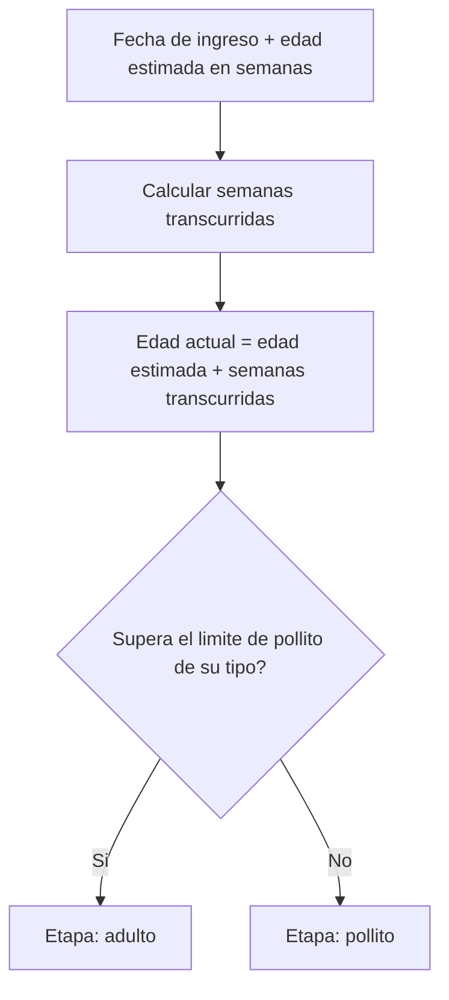
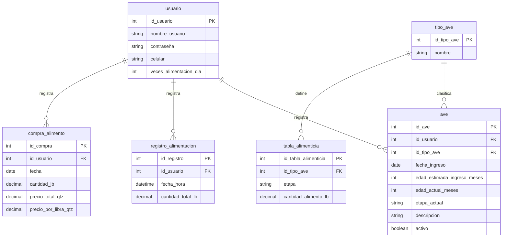
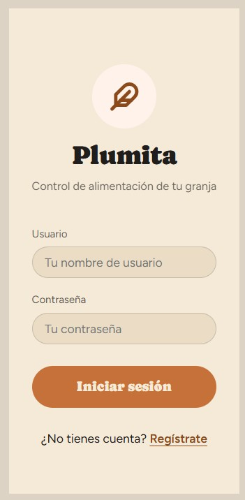
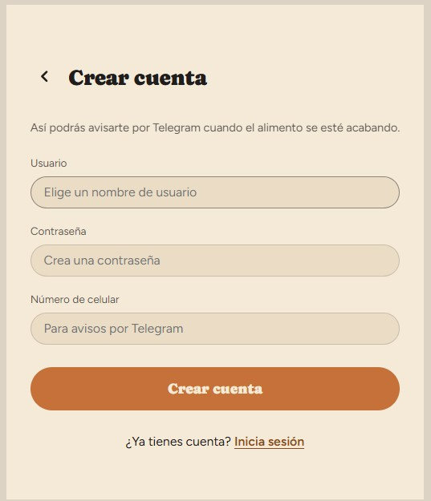
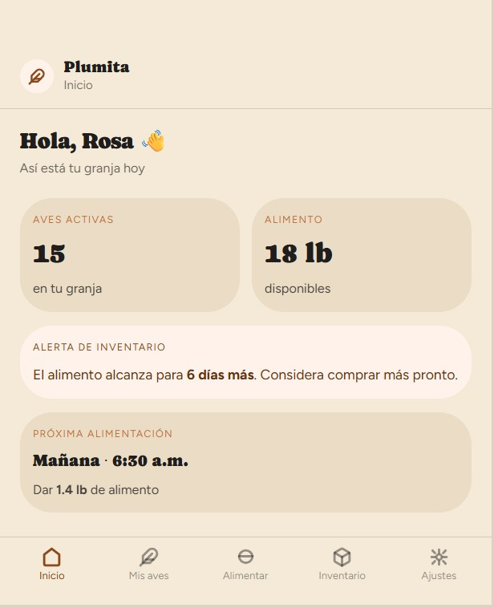
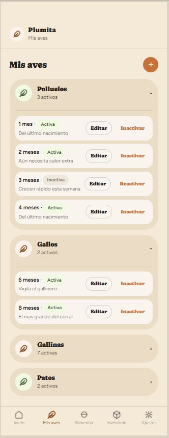
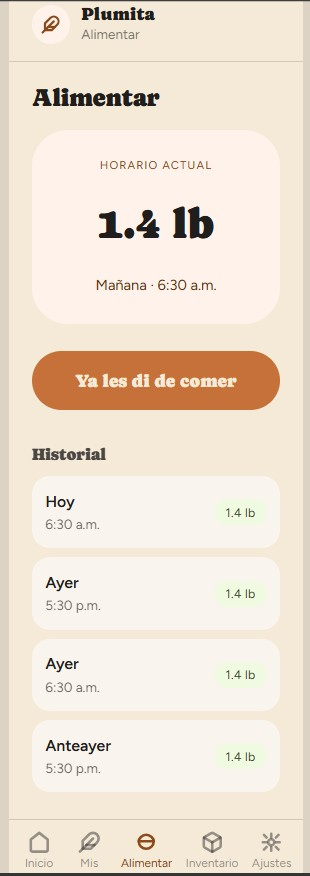
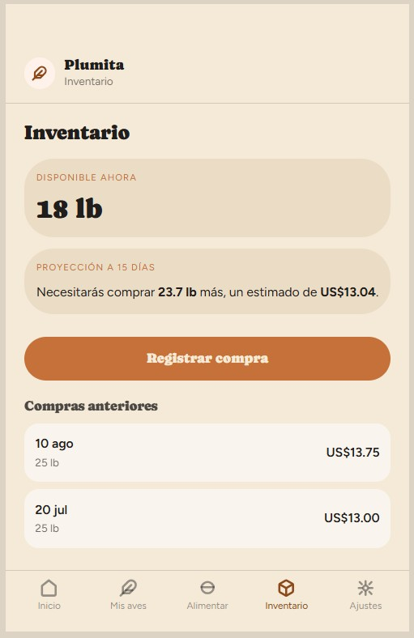
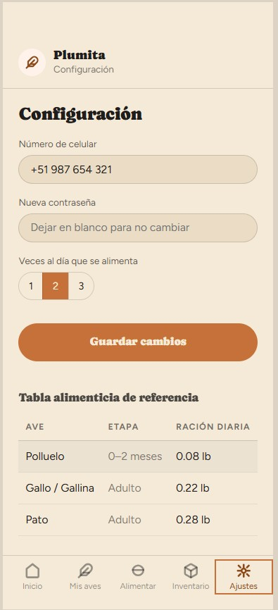

# Documento de Análisis y Diseño (DAD)

## Plumita: aplicación web para el control de alimentación en producción avícola de traspatio

**Elaborado por:** Keila Valesca Ramírez
**Carnet:** 7690-22-2239
**Revisado por:** Melvin Cali
**Curso:** Seminario de Tecnologías de Información
**Fecha:** 21/08/2026
**Versión:** 1.0

---

# CONTENIDO

**Control de versiones**

**1. Introducción**

**2. Contexto general de la solución**
&nbsp;&nbsp;&nbsp;&nbsp;**2.1. Participantes**
&nbsp;&nbsp;&nbsp;&nbsp;**2.2. Flujo funcional de Plumita**
&nbsp;&nbsp;&nbsp;&nbsp;**2.3. Alcance**
&nbsp;&nbsp;&nbsp;&nbsp;**2.4. Limitaciones**
**2.5. Cronograma de actividades**
&nbsp;&nbsp;&nbsp;&nbsp;**2.5.1. Tabla de actividades**
&nbsp;&nbsp;&nbsp;&nbsp;**2.5.2. Diagrama de Gantt**

**3. Descripción del proceso de solución**
&nbsp;&nbsp;&nbsp;&nbsp;**3.1. Requisitos funcionales (RF)**
&nbsp;&nbsp;&nbsp;&nbsp;**3.2. Requisitos no funcionales (RNF)**
&nbsp;&nbsp;&nbsp;&nbsp;**3.3. Dependencias**
&nbsp;&nbsp;&nbsp;&nbsp;**3.4. Descripción de las pantallas / unidades funcionales**
&nbsp;&nbsp;&nbsp;&nbsp;**3.5. Diagrama y descripción del proceso técnico**
&nbsp;&nbsp;&nbsp;&nbsp;&nbsp;&nbsp;&nbsp;&nbsp;3.5.1. Actualización automática de la edad
&nbsp;&nbsp;&nbsp;&nbsp;&nbsp;&nbsp;&nbsp;&nbsp;3.5.2. Cálculo de la cantidad de alimento

**4. Diseño de la base de datos**
&nbsp;&nbsp;&nbsp;&nbsp;**4.1. Estructura de tablas**
&nbsp;&nbsp;&nbsp;&nbsp;**4.2. Diagrama entidad-relación**

**5. Test**
&nbsp;&nbsp;&nbsp;&nbsp;**5.1. Casos de prueba**

**6. Glosario**

**7. Anexos**
&nbsp;&nbsp;&nbsp;&nbsp;**7.1. Mockups de pantallas**

## Control de versiones

| Fecha | Versión | Autor | Descripción |
|---|---|---|---|
| 21/08/2026| 1.0 | Keila Valesca Ramirez | Creación del documento |

---

## 1. Introducción

Este documento explica cómo está pensado por dentro el sistema Plumita, una aplicación web enfocada en resolver un problema bien concreto: el control del alimento que se les da a las aves en una granja pequeña de traspatio. La idea nace de una situación real, porque quien maneja la granja lleva todo el registro de forma manual, sin ningún control exacto de cuánto alimento se compra, cuánto se consume ni cuánto cuesta mantener a las aves.

Con Plumita se busca que esa persona pueda registrar desde su celular la alimentación diaria de sus aves, sin necesidad de hacer cálculos a mano, y que el sistema le diga automáticamente cuánto darles según el tipo y la edad de cada ave. También se busca que tenga un control claro del inventario de alimento y de cuánto necesita comprar antes de que se le acabe.

Este documento describe el contexto general de la solución, los requisitos que debe cumplir, el diseño técnico detrás de cada funcionalidad y cómo está estructurada la información dentro del sistema.

## 2. Contexto general de la solución

### 2.1. Participantes

| Rol | Descripción |
|---|---|
| Usuaria final | Mi mamá Linda , es la dueña de la granja avícola. Es quien registra la alimentación diaria, las compras de alimento y consulta la información del sistema desde su celular. |
| Desarrollador | Estudiante Keila Ramirez encargada del diseño, desarrollo y pruebas del sistema como parte de su proyecto de graduación. |
| Aves de la granja | No son usuarias del sistema, pero son el objeto central sobre el que se calcula toda la información (cantidad de alimento, edad, tipo). |

### 2.2. Flujo funcional de Plumita

Se detalla a continuación:

1. La usuaria ingresa a la aplicación desde el navegador de su celular.
2. Registra o consulta las aves que tiene activas, agrupadas por tipo (gallina, gallo, pato) y por etapa (pollito o adulto).
3. El sistema calcula la edad actual de cada ave en semanas, a partir de la fecha aproximada en que ingresó a la granja y la edad que se estimó en ese momento.
4. La usuaria define a qué horas del día alimenta a sus aves. A cada una de esas horas, el sistema le manda un recordatorio por Telegram con la cantidad que le toca dar.
5. Cuando abre la pantalla de alimentar, el sistema le muestra la cantidad recomendada, calculada según el tipo, la etapa y la cantidad de aves que tiene.
6. La usuaria registra que ya alimentó a las aves, y ese registro queda guardado como parte del historial.
7. Cada vez que compra alimento, lo registra con la cantidad en libras y el precio pagado, y el sistema actualiza el inventario disponible.
8. Con base en el consumo, el sistema le proyecta cuánto alimento va a necesitar y cuánto le va a costar en los próximos 15 días.
9. Si el alimento está por agotarse, el sistema le envía una alerta por Telegram.

### 2.3. Alcance

El sistema Plumita cubre únicamente el módulo de control de alimentación de una granja avícola de traspatio. Dentro de este alcance se incluye:

- Registro y gestión de aves por tipo y etapa.
- Cálculo automático diario de la edad de cada ave.
- Cálculo de la cantidad de alimento a dar según una tabla alimenticia parametrizada.
- Registro y consulta del historial de alimentación.
- Registro de compras de alimento y control del inventario disponible.
- Proyección de cuánto alimento se necesita comprar en un periodo definido, junto con el costo estimado.
- Envío de notificaciones por Telegram.
- Interfaz mobile-first, pensada para usarse desde el navegador de un celular.

### 2.4. Limitaciones

Así como se definió qué sí cubre el sistema, también es importante dejar claro qué queda fuera de este proyecto:

- No incluye otros módulos de gestión de granja como el control sanitario o el financiero general, únicamente el de alimentación.
- No calcula fórmulas nutricionales propias; la tabla alimenticia que usa el sistema es una tabla ya validada y se carga durante el desarrollo, no es editable por la usuaria.
- No pide ni calcula la fecha exacta de nacimiento de las aves, sino que trabaja con una fecha aproximada de ingreso a la granja.
- No se desarrolla como aplicación nativa para tiendas de aplicaciones, sino como una aplicación web accesible desde el navegador.
- No sustituye la asesoría de un médico veterinario o zootecnista.
- No tiene un nivel de disponibilidad garantizado tipo empresarial; su funcionamiento se valida durante el periodo de pruebas con la usuaria real.

## 2.5 Cronograma de actividades

El desarrollo de Plumita sigue las etapas del ciclo de vida del software: análisis, diseño, desarrollo, pruebas e implementación. La fecha límite para tener la aplicación implementada y funcionando es el 31 de octubre.

### Tabla de actividades

| Etapa | Actividad | Fecha inicio | Fecha fin |
|---|---|---|---|
| Análisis | Definición de requisitos funcionales y no funcionales | 24/08 | 30/08 |
| Diseño | Diseño de base de datos, diagrama entidad-relación y mockups | 31/08 | 06/09 |
| Análisis | Ajustes al DAD, tabla alimenticia y arquitectura técnica | 08/10 | 09/10 |
| Desarrollo | Configuración del proyecto, base de datos y primer despliegue | 10/10 | 12/10 |
| Desarrollo | Módulo de cuenta (registro, login, configuración) | 13/10 | 14/10 |
| Desarrollo | Módulo de aves (ingresar, editar, inactivar, edad y etapa) | 15/10 | 17/10 |
| Desarrollo | Módulo de alimentación (cálculo, registro e historial) | 18/10 | 20/10 |
| Desarrollo | Módulo de inventario y proyección a 15 días | 21/10 | 23/10 |
| Desarrollo | Pantalla de inicio y notificaciones por Telegram | 24/10 | 26/10 |
| Pruebas | Casos de prueba y pruebas con la usuaria real | 27/10 | 29/10 |
| Implementación | Corrección de observaciones y despliegue final | 30/10 | 31/10 |

### Diagrama de Gantt

## 3. Descripción del proceso de solución

### 3.1. Requisitos funcionales (RF)

**RF-01. Registro de usuario**
El sistema debe permitir crear una cuenta nueva solicitando usuario, contraseña y número de celular. El número de celular se usa después para enviar las notificaciones de alimentación.

**RF-02. Inicio de sesión**
El sistema debe permitir que la usuaria inicie sesión con su usuario y contraseña.

**RF-03. Editar información de la cuenta**
Desde la pantalla de configuración, la usuaria debe poder editar su número de celular y su contraseña.

**RF-04. Ingresar ave**
El sistema debe permitir registrar una nueva ave, seleccionando el tipo (gallina, gallo o pato), la fecha aproximada de ingreso a la granja, la edad estimada en semanas que tenía en ese momento y una breve descripción.

**RF-05. Editar ave**
El sistema debe permitir editar la fecha de ingreso, la edad estimada en semanas y la descripción de un ave ya registrada.

**RF-06. Inactivar ave**
El sistema debe permitir inactivar un ave en vez de eliminarla, para conservar su historial de alimentación.

**RF-07. Configurar horarios de alimentación**
El sistema debe permitir que la usuaria defina a qué horas del día alimenta a sus aves (por ejemplo 7:00 a. m. y 4:00 p. m.). La cantidad de horarios activos es la cantidad de veces al día que se alimenta.

**RF-08. Calcular cantidad de alimento**
El sistema debe calcular automáticamente cuánto alimento darle a las aves, tomando en cuenta la cantidad de aves según su tipo y etapa, la tabla alimenticia parametrizada y la cantidad de veces al día que se alimenta.

**RF-09. Registrar alimentación**
El sistema debe permitir registrar que se alimentó a las aves, guardando la hora del registro como parte de una bitácora.

**RF-10. Ver historial de alimentación**
El sistema debe mostrar un historial con las alimentaciones registradas anteriormente.

**RF-11. Registrar compra de alimento**
El sistema debe permitir registrar una compra de alimento, ingresando la cantidad comprada en libras y el precio pagado en quetzales.

**RF-12. Ver historial de compras**
El sistema debe mostrar un historial con las compras de alimento registradas.

**RF-13. Mostrar inventario disponible**
El sistema debe mostrar cuánto alimento se tiene disponible en libras, calculado a partir de lo comprado menos lo consumido.

**RF-14. Proyectar necesidad de compra**
El sistema debe proyectar cuánta cantidad de alimento se va a necesitar en un periodo de tiempo definido y cuánto costaría esa compra, usando como base el consumo promedio y el precio por libra registrado.

**RF-15. Recordatorio de alimentación**
A cada hora configurada, el sistema debe enviar un recordatorio por Telegram con la cantidad de alimento que corresponde dar en esa toma.

**RF-16. Enviar notificación de inventario bajo**
El sistema debe enviar una notificación por Telegram cuando el inventario de alimento esté por agotarse.

**RF-17. Vincular Telegram**
Desde la pantalla de configuración, la usuaria debe poder vincular su cuenta de Telegram con el bot de Plumita. El sistema le muestra un enlace al bot; ella toca "Iniciar" y la cuenta queda vinculada para recibir mensajes.

### 3.2. Requisitos no funcionales (RNF)

**RNF-01. Diseño mobile-first**
El sistema debe estar diseñado principalmente para usarse desde el navegador de un celular, ya que es el único dispositivo que utiliza la usuaria final.

**RNF-02. Tiempo de carga**
Las pantallas principales deben cargar en menos de 2 segundos.

**RNF-03. Cálculo automático de edad**
El sistema no guarda la edad actual del ave, sino que la calcula cada vez que la necesita, sumando la edad estimada al ingresar más las semanas que han pasado desde la fecha de ingreso. Así la edad y la etapa siempre están al día sin depender de un proceso diario.

**RNF-04. Tabla alimenticia parametrizada**
El sistema debe contar con una tabla alimenticia organizada por tipo de ave y etapa (pollito o adulto). Esta tabla se carga durante el desarrollo del sistema y no puede ser editada por la usuaria.

**RNF-05. Bitácora de alimentación**
Cada registro de alimentación debe guardar la hora exacta en la que se realizó, para mantener un historial confiable.

**RNF-06. Validación de precio de compra**
Al registrar una compra, el sistema debe guardar el precio por libra pagado, ya que ese valor se usa como base para proyectar el costo de la próxima compra.

**RNF-07. Margen de error en la proyección**
La proyección a 15 días incluye un margen del 10 % por defecto, para cubrir los días en que se da un poco más de lo recomendado.

**RNF-08. Disponibilidad durante pruebas**
El sistema debe mantenerse disponible durante el periodo de pruebas con la usuaria real, sin que esto implique una garantía formal de disponibilidad a nivel empresarial.

**RNF-09. Umbral de inventario bajo**
El sistema considera que el alimento está por agotarse cuando alcanza para 3 días o menos, según el consumo diario calculado.

### 3.3. Dependencias

**Telegram (Bot API)**
Telegram no permite que un bot le escriba a alguien solo con su número de celular. Por eso la usuaria debe abrir el bot de Plumita desde el enlace que le da la app y tocar "Iniciar". En ese momento el sistema guarda su identificador de chat y a partir de ahí ya puede mandarle recordatorios y alertas.

**Servicio de hosting web**
El sistema depende de un servicio de hosting para que la aplicación web esté disponible durante el periodo de pruebas con la usuaria.

## 3.4. Descripción de las pantallas / unidades funcionales

**Login**
Pantalla de entrada al sistema. Solicita usuario y contraseña. Si las credenciales son correctas, la usuaria pasa a la pantalla de inicio; si no, el sistema muestra un mensaje de error.

**Registro**
Permite crear una cuenta nueva. Solicita usuario, contraseña y número de celular. El número de celular queda guardado como el destino de las notificaciones de Telegram.

**Inicio**
Es el punto de partida después de iniciar sesión. Muestra un resumen general: cuántas aves activas se tienen, cuánto alimento hay disponible en inventario, para cuántos días alcanza ese alimento y a qué hora es la próxima alimentación con su cantidad recomendada. Esta pantalla le da a la usuaria una idea rápida del estado de la granja sin tener que entrar a otra sección.

**Mis aves**
Muestra las aves activas agrupadas por tipo (gallina, gallo, pato) y por etapa (pollito o adulto). Desde aquí se puede agregar una nueva ave llenando un formulario con tipo, fecha aproximada de ingreso, edad estimada en ese momento y descripción. También se puede editar o inactivar una ave ya existente.

**Alimentar**
Muestra la cantidad de alimento que corresponde dar en ese momento, ya calculada por el sistema. Tiene un botón para registrar que se alimentó a las aves, lo cual queda guardado en el historial con la hora exacta. Debajo se muestra el historial reciente de alimentaciones.

**Inventario**
Muestra cuánto alimento hay disponible en libras. Incluye una proyección de cuánto alimento se necesita comprar para cubrir un periodo definido y el costo estimado de esa compra. Tiene un botón para registrar una nueva compra (cantidad en libras y precio pagado) y muestra el historial de compras anteriores.

**Configuración**
Permite editar el número de celular y la contraseña de la cuenta, así como la cantidad de veces al día que se alimenta a las aves. También muestra, solo para consulta, la tabla alimenticia parametrizada por tipo de ave y etapa.

## 3.5. Diagrama y descripción del proceso técnico

### 3.5.1. Actualización automática de la edad

Cada ave guarda su fecha aproximada de ingreso y la edad estimada en semanas que tenía en ese momento. Cuando el sistema necesita saber su edad, hace esta cuenta:

> edad actual (semanas) = edad estimada al ingresar + semanas transcurridas desde la fecha de ingreso

Si la edad actual no pasa del límite de pollito de su tipo, el ave está en etapa pollito; si lo pasa, está en etapa adulto.

### 3.5.2. Cálculo de la cantidad de alimento

Cuando llega la hora de alimentar, el sistema toma la cantidad de aves agrupadas por tipo y etapa, busca en la tabla alimenticia parametrizada cuánto le corresponde a cada grupo, y divide ese total entre la cantidad de veces al día que se alimenta. El resultado es la cantidad exacta que la usuaria debe dar en ese momento.

> cantidad por toma (lb) = suma de (aves activas del grupo × consumo diario por ave del grupo) ÷ horarios activos

## 4. Diseño de la base de datos

### 4.1. Estructura de tablas

**usuario**
Guarda la información de la cuenta de la usuaria y su configuración general.

| Campo | Tipo | Descripción |
|---|---|---|
| id_usuario | INT (PK) | Identificador único del usuario |
| nombre_usuario | VARCHAR | Usuario para iniciar sesión |
| contraseña | VARCHAR | Contraseña encriptada |
| celular | VARCHAR | Número de celular para notificaciones por Telegram |
| telegram_chat_id | VARCHAR | Identificador de chat guardado al vincular Telegram |
| codigo_vinculacion | VARCHAR | Código temporal para vincular la cuenta con el bot |
| margen_proyeccion_pct | DECIMAL | Margen de la proyección, 10 % por defecto |

**tipo_ave**
Catálogo fijo con los tipos de ave que maneja el sistema.

| Campo | Tipo | Descripción |
|---|---|---|
| id_tipo_ave | INT (PK) | Identificador único del tipo de ave |
| nombre | VARCHAR | Nombre del tipo (gallina, gallo, pato) |
| semanas_limite_pollito | INT | Semanas hasta las que el ave se considera pollito |

**ave**
Guarda cada ave registrada por la usuaria.

| Campo | Tipo | Descripción |
|---|---|---|
| id_ave | INT (PK) | Identificador único del ave |
| id_usuario | INT (FK) | Usuaria dueña del ave |
| id_tipo_ave | INT (FK) | Tipo de ave según catálogo |
| fecha_ingreso | DATE | Fecha aproximada en la que el ave ingresó a la granja |
| edad_estimada_ingreso_semanas | INT | Edad aproximada en semanas al momento de ingresar |
| descripcion | VARCHAR | Descripción breve del ave |
| activo | BOOLEAN | Indica si el ave sigue activa o fue inactivada |

**tabla_alimenticia**
Tabla parametrizada con la cantidad de alimento recomendada. Se carga durante el desarrollo y no es editable por la usuaria.

| Campo | Tipo | Descripción |
|---|---|---|
| id_tabla_alimenticia | INT (PK) | Identificador único del registro |
| id_tipo_ave | INT (FK) | Tipo de ave al que aplica |
| etapa | VARCHAR | Etapa a la que aplica (pollito o adulto) |
| consumo_diario_lb | DECIMAL | Alimento recomendado por ave al día, en libras |

**registro_alimentacion**
Bitácora de cada vez que se registró una alimentación.

| Campo | Tipo | Descripción |
|---|---|---|
| id_horario | INT (PK) | Identificador del horario |
| id_usuario | INT (FK) | Usuaria dueña del horario |
| hora | TIME | Hora en la que se alimenta |
| activo | BOOLEAN | Si el horario está en uso |

**compra_alimento**
Guarda cada compra de alimento registrada.

| Campo | Tipo | Descripción |
|---|---|---|
| id_compra | INT (PK) | Identificador único de la compra |
| id_usuario | INT (FK) | Usuaria que registró la compra |
| fecha | DATE | Fecha de la compra |
| cantidad_lb | DECIMAL | Cantidad comprada, en libras |
| precio_total_qtz | DECIMAL | Precio total pagado, en quetzales |
| precio_por_libra_qtz | DECIMAL | Precio por libra, calculado a partir del total |

### 4.2. Diagrama entidad-relación

Tomando en cuenta que el inventario disponible no se guarda como una tabla aparte: se calcula sumando lo registrado en `compra_alimento` y restando lo registrado en `registro_alimentacion`. Así se evita duplicar información y el dato siempre queda actualizado según los movimientos reales.

## 4.3. Tabla alimenticia parametrizada (valores preliminares)

Estos valores son aproximados y sirven para arrancar el desarrollo. Se van a confirmar en la fase de investigación.

| Tipo de ave | Límite de pollito | Consumo pollito (lb/día) | Consumo adulto (lb/día) |
|---|---|---|---|
| Gallina | 8 semanas | 0.07 | 0.24 |
| Gallo | 8 semanas | 0.07 | 0.26 |
| Pato | 7 semanas | 0.13 | 0.37 |

## 5. Test

### 5.1. Casos de prueba

| ID | Caso de prueba | Entrada | Resultado esperado |
|---|---|---|---|
| CP-01 | Registro de usuario | Usuario, contraseña y celular válidos | Se crea la cuenta y queda disponible para iniciar sesión |
| CP-02 | Inicio de sesión correcto | Usuario y contraseña correctos | El sistema muestra la pantalla de inicio |
| CP-03 | Inicio de sesión incorrecto | Usuario o contraseña incorrectos | El sistema muestra un mensaje de error y no permite el acceso |
| CP-04 | Ingresar ave | Tipo de ave, fecha de ingreso y edad estimada | El ave queda registrada y aparece en el listado de "Mis aves" |
| CP-05 | Actualización automática de edad | Ave registrada con fecha de ingreso pasada | Al día siguiente, la edad mostrada aumenta según los días transcurridos |
| CP-06 | Cambio de etapa por edad | Ave que alcanza la edad límite de pollito | El sistema reclasifica al ave como adulto automáticamente |
| CP-07 | Inactivar ave | Ave activa seleccionada para inactivar | El ave deja de aparecer en el conteo activo, pero conserva su historial |
| CP-08 | Cálculo de alimento | Cantidad de aves por tipo/etapa y veces al día configuradas | El sistema muestra la cantidad correcta de alimento a dar |
| CP-09 | Registrar alimentación | Confirmación de alimentación desde la pantalla "Alimentar" | Se guarda el registro con la hora exacta y aparece en el historial |
| CP-10 | Registrar compra de alimento | Cantidad en libras y precio en quetzales | El inventario disponible se actualiza y la compra aparece en el historial |
| CP-11 | Proyección de compra | Consumo histórico y margen de error configurado | El sistema muestra cuánto alimento se necesita y el costo estimado para el periodo definido |
| CP-12 | Notificación de inventario bajo | Inventario por debajo del umbral definido | Se envía una notificación por Telegram al celular registrado |
| CP-13 | Edición de configuración | Cambio de celular o contraseña | Los nuevos datos quedan guardados y se usan en los siguientes envíos |
| CP-14 | Vincular Telegram | La usuaria abre el enlace y toca "Iniciar" | La cuenta queda vinculada y llega un mensaje de bienvenida |
| CP-15 | Recordatorio por horario | Horario configurado a una hora próxima | Llega el recordatorio con la cantidad a dar en esa toma |

## 7. Glosario

| Término | Definición |
|---|---|
| DAD | Documento de Análisis y Diseño, describe cómo funciona un sistema por dentro antes de construirlo. |
| RF | Requisito funcional, algo que el sistema debe hacer. |
| RNF | Requisito no funcional, una condición de calidad que el sistema debe cumplir (velocidad, disponibilidad, etc.). |
| Bitácora | Registro histórico de eventos con fecha y hora, en este caso de cada alimentación realizada. |
| Etapa | Clasificación del ave según su edad: pollito o adulto. |
| Tabla alimenticia parametrizada | Tabla con las cantidades de alimento recomendadas por tipo y etapa de ave, definida durante el desarrollo. |
| Mobile-first | Enfoque de diseño donde la aplicación se construye pensando primero en cómo se ve y funciona en un celular. |
| Inventario | Cantidad de alimento disponible en un momento dado, calculada a partir de compras menos consumo. |
| Proyección | Estimación de cuánto alimento se necesitará comprar en un periodo futuro, basada en el consumo histórico. |

## 8. Anexos

### 8.1. Mockups de pantallas

**Login**

**Registro**

**Inicio**

**Mis aves**

**Alimentar**

**Inventario**

**Configuración**

