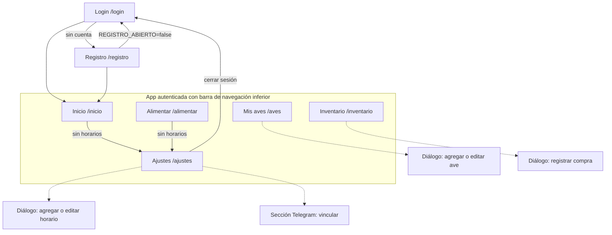

# Análisis de Plumita

Fuentes: [DAD v1.1](DAD.md) con los cambios de [DAD-v1.2-diff.md](DAD-v1.2-diff.md), mockups en `docs/mockups/` y las decisiones de la Fase 0. Ante contradicción, manda el DAD sobre los mockups.

## 1. Requisitos funcionales

Los RF-01 a RF-17 vienen del DAD. Cambian RF-06, RF-07, RF-15 y RF-17, y se añaden RF-18 a RF-20 (detalle en el diff v1.2).

| ID | Requisito | Pantalla | Notas de implementación |
|---|---|---|---|
| RF-01 | Registro (usuario, contraseña, celular) | Registro | Solo si `REGISTRO_ABIERTO=true`. Contraseña con argon2. El celular es solo dato de contacto. |
| RF-02 | Inicio de sesión | Login | Cookie firmada, httpOnly, sameSite=lax, 30 días. Rate limiting. |
| RF-03 | Editar celular y contraseña | Ajustes | Contraseña en blanco = no cambia. |
| RF-04 | Ingresar ave | Mis aves (diálogo) | Tipo (gallina, gallo, pato), fecha de ingreso, edad estimada en semanas, descripción. |
| RF-05 | Editar ave | Mis aves (diálogo) | Fecha de ingreso, edad estimada y descripción. El tipo no se edita en el DAD (ver decisión D-1). |
| RF-06 | Inactivar y reactivar ave | Mis aves | Se añade reactivar, que el mockup ya muestra. Nunca se borra. |
| RF-07 | Horarios de alimentación | Ajustes | Máximo 3 por usuaria (constante `MAX_HORARIOS`), sin mínimo. Hora única por usuaria. |
| RF-08 | Calcular cantidad por toma | Alimentar, Inicio | Sin horarios activos, se pide configurar uno. |
| RF-09 | Registrar alimentación | Alimentar | Cantidad prellenada con la recomendada y editable. |
| RF-10 | Historial de alimentación | Alimentar | Paginado, más reciente primero. |
| RF-11 | Registrar compra | Inventario (diálogo) | Libras y total en Q. El precio por libra se calcula y se guarda. |
| RF-12 | Historial de compras | Inventario | |
| RF-13 | Inventario disponible | Inventario, Inicio | Compras menos consumo registrado, con piso en 0 al mostrar. |
| RF-14 | Proyección a 15 días | Inventario | `max(0, consumo × 15 × (1 + margen) − inventario)`. Costo con el precio por libra de la última compra. |
| RF-15 | Recordatorio por Telegram | (segundo plano) | Se omite si hubo alimentación en los 60 min previos al horario. Estado `omitido`. |
| RF-16 | Alerta de inventario bajo | (segundo plano) | ≤ 3 días. Se envía una vez y se rehabilita al registrar una compra. |
| RF-17 | Vincular Telegram | Ajustes | Deep link `t.me/<bot>?start=<codigo>`. Código de un solo uso que expira a los 10 min. Recepción por long polling. |
| RF-18 | Registro cerrable | Registro | `REGISTRO_ABIERTO=false` en producción tras crear la cuenta de Linda. |
| RF-19 | Cerrar sesión | Ajustes | Ni el DAD ni los mockups lo traen. Se añade (decisión D-2). |
| RF-20 | Desvincular Telegram | Ajustes | Opcional, ver D-3. |

### Decisiones tomadas en el análisis

- **D-1** El tipo de ave no se edita. Si se equivocó, se inactiva y se crea otra. Así no se reinterpreta el historial.
- **D-2** Se añade el botón "Cerrar sesión" en Ajustes. Sin él, la usuaria no puede salir desde el celular.
- **D-3** RF-20 queda como mejora de baja prioridad. Se implementa solo si sobra tiempo en F6.
- **D-4** Cantidad mostrada y prellenada con 2 decimales (se quitan los ceros sobrantes: "1.4 lb", "0.69 lb"). Se guarda lo que la usuaria confirma, con 2 decimales. Revisada el 9/10 para que la proyección coincida con las fórmulas del DAD sin pérdida de precisión.
- **D-5** Edad siempre en semanas en toda la UI, sin meses ni textos de apoyo.
- **D-6** En Alimentar, el horario solo cambia la etiqueta ("Mañana · 6:30 a.m."). Se muestra el activo más reciente que ya pasó hoy, o el próximo si ninguno ha pasado.

## 2. Requisitos no funcionales

| ID | Requisito | Cómo se verifica |
|---|---|---|
| RNF-01 | Mobile-first | Diseño base a 360–390 px. Revisión en el celular real. |
| RNF-02 | Pantallas principales en menos de 2 s | Medición manual en LAN. Consultas con índices y sin N+1. |
| RNF-03 | Edad y etapa calculadas al vuelo | Tests unitarios de `edad.ts`. Nada de edad en la BD. |
| RNF-04 | Tabla alimenticia constante, cargada por seed | `prisma db seed` idempotente (upsert). |
| RNF-05 | Bitácora con hora exacta | `fecha_hora` como `timestamptz`, mostrada en America/Guatemala. |
| RNF-06 | Guardar precio por libra | Se calcula en el servidor al registrar la compra. |
| RNF-07 | Margen de proyección 10 % | `margen_proyeccion_pct` con default 10, sin pantalla. |
| RNF-08 | Disponibilidad durante pruebas | `restart: unless-stopped`, healthcheck y backup. |
| RNF-09 | Umbral de inventario bajo: 3 días | Flag `alerta_inventario_enviada`. |
| RNF-10 | Zona horaria America/Guatemala | `TZ` en el contenedor y helper único `lib/tiempo.ts`. |
| RNF-11 | Credenciales y sesión | argon2id, cookie firmada, httpOnly, sameSite=lax, `COOKIE_SECURE` por entorno. |
| RNF-12 | Rate limiting en login | 5 fallos en 15 min bloquean 15 min, por usuario y por IP. Tabla `intento_login`. |
| RNF-13 | Validación en servidor | zod en cada Server Action y Route Handler. |
| RNF-14 | Backup con restauración probada | Script de backup y script de restauración sobre BD temporal, ejecutados y registrados. |
| RNF-15 | Accesibilidad WCAG AA básico | Contraste 4.5:1 en texto, foco visible, etiquetas en campos, objetivos táctiles de 44 px. Ver riesgo R-5. |
| RNF-16 | Configuración por entorno (solo análisis) | `.env.example` completo y validación de env con zod al arrancar. |
| RNF-17 | CI (solo análisis) | GitHub Actions: lint, typecheck, tests y build en cada push. |
| RNF-18 | HTTPS (solo análisis) | No aplica en localhost. La guía de VPS lo documenta con TLS automático, sin ejecutarla (ADR 0004). |

## 3. Riesgos

| ID | Riesgo | Prob. | Impacto | Mitigación |
|---|---|---|---|---|
| R-1 | **No hay servidor.** Todo corre en la máquina de la desarrolladora. Si se apaga, se duerme o cambia de red, no hay recordatorios ni acceso de Linda. | Alta | Alto | Definir qué significa "desplegada" el 31/10: Compose en localhost, con el equipo encendido en las pruebas. Desactivar suspensión y reservar IP en el router. Ventana de 10 min tolera cortes cortos. Documentar la guía de VPS como siguiente paso. |
| R-2 | El celular de Linda debe estar en la misma red para usar la app por IP local. | Alta | Medio | Documentado en `operacion.md`: IP fija o reserva DHCP, regla de firewall de Windows y puerto 3000. |
| R-3 | Long polling vive dentro del proceso de la app. Si cae, no llegan los `/start`. | Media | Medio | Reintento con espera creciente, log de errores y un solo consumidor garantizado por singleton. El código dura 10 min, así que basta reintentar vinculación. |
| R-4 | Valores de pato sin fuente (DAD 4.3). | Alta | Medio | Seed con los valores del DAD, marcados como pendientes. Confirmarlos con Linda en F7. |
| R-5 | El color de acento de Organic no cumple AA para texto. Crema sobre `--color-accent` da ≈2.8:1, y el kicker de 10 px y el nav en gris al 45 % también fallan. | Alta | Medio | Botones y textos pequeños en `--color-accent-700` (≈5.9:1). Nav inactivo en `--color-neutral-700`. Se documenta como desviación del mockup y se valida en F1. |
| R-6 | Doble envío de recordatorios (reinicio, doble tick, reintentos). | Media | Medio | Unicidad (usuario, horario, fecha) más inserción atómica antes de enviar. Ver arquitectura §7. |
| R-7 | Pérdida de datos por borrar el volumen de Docker. | Media | Alto | Backup periódico fuera del volumen y restauración probada. `pgdata/` fuera de git. |
| R-8 | El plazo es corto: 22 días de desarrollo con 8 fases. | Media | Alto | Alcance cerrado, sin extras. Si algo se retrasa, cae RF-20 y los pulidos antes que pruebas. |
| R-9 | Solo hay dos etapas en la tabla alimenticia, aunque el ave sigue creciendo. | Alta | Bajo | Margen del 10 % en la proyección, ya aceptado en el DAD 2.4. |
| R-10 | Si el servidor no tiene internet, Telegram falla. | Media | Medio | Estado `error` con hasta 3 reintentos dentro de la ventana. La app sigue funcionando sin Telegram. |
| R-11 | La cookie firmada sin tabla de sesiones no se puede revocar. | Baja | Bajo | Aceptado: una usuaria, 30 días. Cambiar `SESSION_SECRET` invalida todas. |
| R-12 | Los mockups traen US$, meses y +51, distintos del DAD. | Alta | Bajo | Se aplicó el DAD. Los textos de las capturas se corrigen al implementar. |

## 4. Mapa de pantallas

| Ruta | Mockup | Contenido | Estados a cubrir |
|---|---|---|---|
| `/login` | `login.jpg` | Usuario, contraseña y enlace a registro. | Error de credenciales, bloqueo por rate limit. |
| `/registro` | `registro.jpg` | Usuario, contraseña, celular. | Errores por campo, registro cerrado, usuario repetido. Texto corregido (D del diff). |
| `/inicio` | `inicio.jpg` | Saludo, aves activas, inventario en lb, tarjeta de días de alcance y próxima alimentación. | Sin aves, sin horarios, sin compras, sin Telegram vinculado. La tarjeta pasa a estilo de alerta con ≤ 3 días. |
| `/aves` | `mis-aves.jpg` | 4 banners colapsables: Polluelos, Gallinas adultas, Gallos adultos, Patos adultos. Filas con edad en semanas, estado, Editar e Inactivar o Reactivar. Botón "+". | Grupo vacío, ave inactiva. |
| `/alimentar` | `alimentar.jpg` | Cantidad recomendada, etiqueta de horario, botón "Ya les di de comer" e historial. | Sin horarios, sin aves, confirmación con cantidad editable. |
| `/inventario` | `inventario.jpg` | Disponible, proyección a 15 días, "Registrar compra" e historial de compras. | Sin compras (proyección sin costo), sin aves, inventario en 0. |
| `/ajustes` | `configuracion.jpg` | Celular, contraseña, **horarios** (lista de hasta 3), **Telegram**, tabla alimenticia de referencia y cerrar sesión. | Horarios en el máximo, Telegram vinculado o no, código expirado. |

Pantallas **sin mockup**, a diseñar con componentes Organic en F3 y F6:

- **Gestión de horarios:** lista de tarjetas con hora, interruptor activo y Editar o Eliminar. Botón "Agregar horario" deshabilitado al llegar al máximo. Diálogo con `input type="time"`.
- **Vinculación de Telegram:** tarjeta con estado (`Sin vincular` o `Vinculado`) y botón "Vincular Telegram". Genera el código y muestra el botón "Abrir Telegram" (deep link) con el tiempo restante. Al vincularse, la pantalla se actualiza.

## 5. Componentes reutilizables

Sobre las clases de Organic (`.btn`, `.tag`, `.field`, `.input`, `.seg`, `.card`, `.nav`, `.table`, `.dialog`). La app los envuelve en componentes React y no inventa clases paralelas.

| Componente | Base Organic | Usado en |
|---|---|---|
| `Boton` (primario, secundario, fantasma, ícono) | `.btn-*` | Todas |
| `Etiqueta` (Activa, Inactiva, cantidad) | `.tag-*` | Aves, Alimentar |
| `Campo` (label, input, error, ayuda) | `.field`, `.input` | Login, Registro, Ajustes, diálogos |
| `Segmentado` | `.seg` | Selector de tipo de ave |
| `Tarjeta` y `TarjetaMetrica` (kicker, valor, pie) | `.card-*` | Inicio, Inventario, Alimentar |
| `Dialogo` | `.dialog-*` | Ave, compra, horario |
| `BarraSuperior` (marca y título) | `.nav` | Layout autenticado |
| `NavegacionInferior` (5 pestañas con íconos Lucide) | propio, con tokens | Layout autenticado |
| `GrupoAves` y `FilaAve` (colapsable con chevron) | `.card` | Mis aves |
| `FilaHistorial` (fecha, hora, cantidad) | `.card` | Alimentar, Inventario |
| `TablaReferencia` | `.table` | Ajustes |
| `AvisoFormulario` y `Toast` (resultado de acciones) | `.card` con rampa | Todas |
| `EstadoVacio` | `.card` | Aves, historiales |

## 6. Design tokens de Organic

Fuente: `docs/mockups/_ds/organic-*/styles.css`. Se importa tal cual y no se redefine ningún valor.

**Color:** `--color-bg` #f5ead8 (fondo), `--color-surface` #ebddc5, `--color-text` #201e1d, `--color-accent` #c67139 (terracota), `--color-accent-2` #7a8a5e (salvia), `--color-divider` (texto al 16 %). Rampas 100–900 para `neutral`, `accent` y `accent-2`. En uso: neutro 200 para fondo de etiquetas inactivas, accent 100 para el círculo del logo y las alertas, accent-2 100/800 para la etiqueta "Activa".

**Tipografía:** `--font-heading` Caprasimo (400), `--font-body` Figtree (400/600/700). Cuerpo de 15 px y línea 1.55. Escala h1 42, h2 32, h3 25, h4 20, h5 16, h6 13. Kicker de 10 px en mayúsculas (se sube a 11–12 px con `--color-accent-700` por R-5).

**Espaciado:** `--space-1` 4.4, `-2` 8.8, `-3` 13.2, `-4` 17.6, `-6` 26.4, `-8` 35.2 px.

**Radios:** `--radius-sm` 8, `--radius-md` 16, `--radius-lg` 28 px. Botones e inputs en píldora (999 px).

**Sombras:** `--shadow-sm`, `-md`, `-lg`.

**Íconos:** Lucide, trazo 2.75.

**Estados:** foco `2px solid var(--color-accent)` con `outline-offset: 2px`, deshabilitado al 45 %.

**Ajustes AA propios de Plumita** (sin tocar los tokens):

- Fondo del botón primario: `--color-accent-700`.
- Texto pequeño en acento: `--color-accent-700`.
- Navegación inactiva: `--color-neutral-700`.
- Objetivo táctil mínimo de 44 × 44 px (Organic usa botones de 36 px).
- Fuente cargada con `next/font`, no con el `@import` de Google, para no depender de red externa en carga.

## 7. Fuera de alcance

Kubernetes, OpenTelemetry, MFA y passkeys, feature flags, SBOM, i18n y recuperación de contraseña. Ver [ADR 0004](adr/0004-fuera-de-alcance.md). Tampoco se ejecuta el despliegue en VPS con TLS: se documenta en `operacion.md`.
