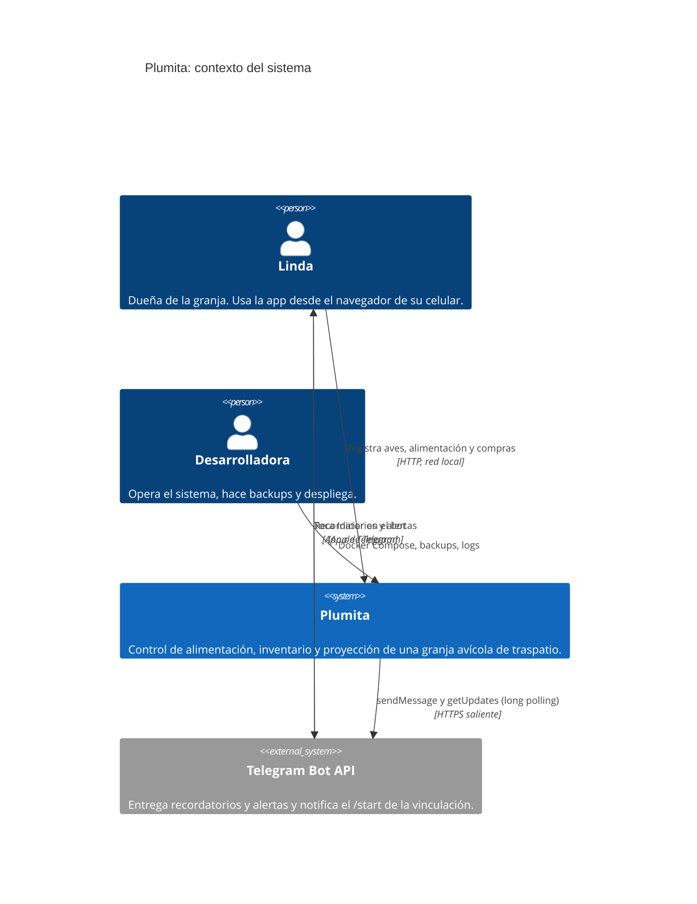
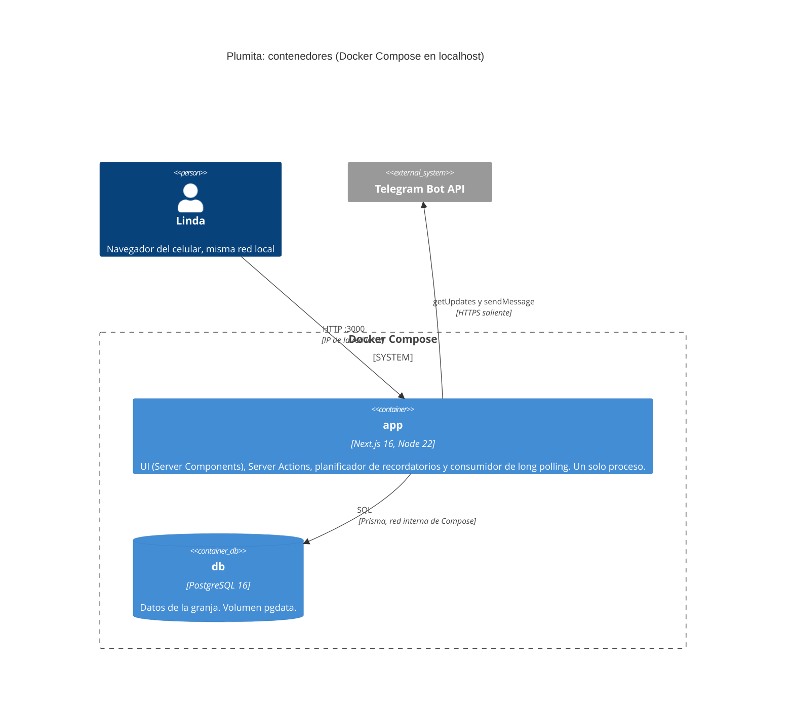
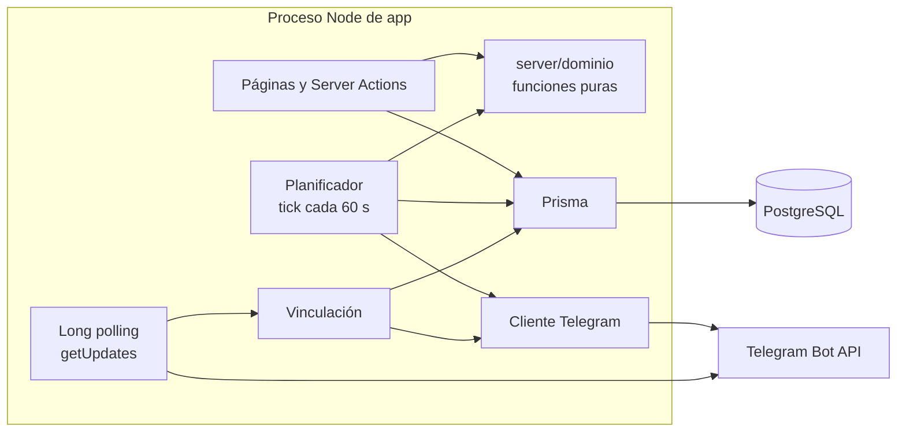
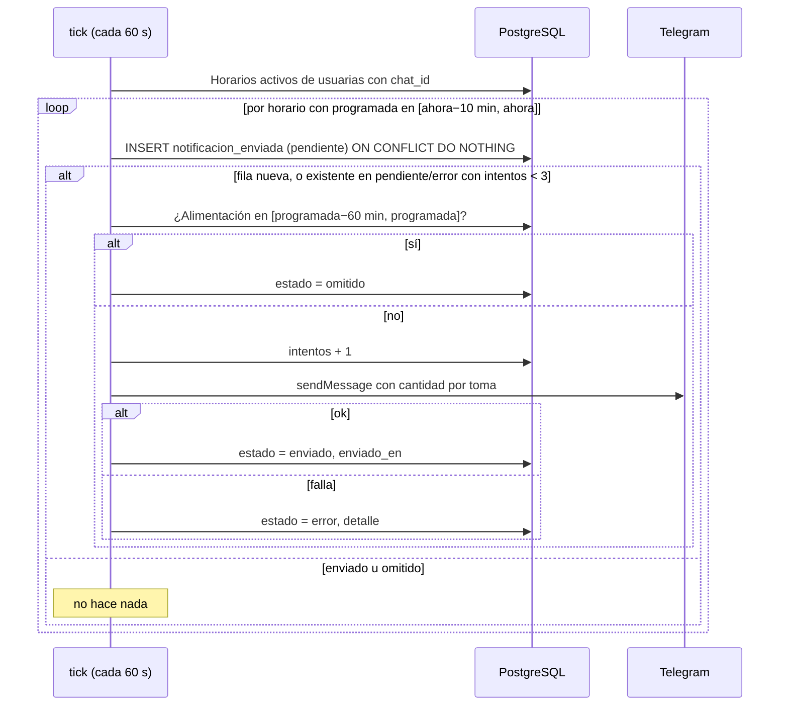

# Arquitectura de Plumita

Monolito en Next.js (App Router, TypeScript estricto) con PostgreSQL y Prisma, en Docker Compose (`app` + `db`). Todo corre en localhost durante el proyecto. Ver [ADR 0001](adr/0001-stack.md).

## 1. C4 nivel 1: contexto



Plumita no expone nada a internet. Todas las conexiones con Telegram son salientes, por eso no hace falta URL pública.

## 2. C4 nivel 2: contenedores



Procesos dentro de `app` (todos arrancan desde `instrumentation.ts`, solo con `NEXT_RUNTIME=nodejs`):



Reverse proxy con TLS (Caddy) y VPS: documentado, no ejecutado. Ver `operacion.md`.

## 3. Estructura de carpetas

```
plumita/
├─ CLAUDE.md
├─ README.md
├─ .env.example
├─ docker-compose.yml
├─ Dockerfile
├─ docker/
│  ├─ entrypoint.sh              migrate deploy, seed y arranque
│  └─ backup/                    backup.sh, restore-test.sh
├─ .github/workflows/ci.yml
├─ docs/                         DAD, análisis, ADR, roadmap, mockups
├─ prisma/
│  ├─ schema.prisma
│  ├─ migrations/
│  └─ seed.ts                    tipo_ave y tabla_alimenticia (upsert)
├─ src/
│  ├─ instrumentation.ts         arranca planificador y long polling
│  ├─ (sin middleware)           la sesión se exige en (app)/layout.tsx y en cada acción
│  ├─ app/
│  │  ├─ layout.tsx, globals.css (importa styles.css de Organic)
│  │  ├─ (auth)/login/page.tsx
│  │  ├─ (auth)/registro/page.tsx
│  │  ├─ (app)/layout.tsx        barra superior y navegación inferior
│  │  ├─ (app)/inicio/page.tsx
│  │  ├─ (app)/aves/page.tsx
│  │  ├─ (app)/alimentar/page.tsx
│  │  ├─ (app)/inventario/page.tsx
│  │  ├─ (app)/ajustes/page.tsx
│  │  └─ api/health/route.ts     única ruta HTTP
│  ├─ components/
│  │  ├─ ui/                     Boton, Etiqueta, Campo, Dialogo, Tarjeta, Segmentado, Toast...
│  │  └─ app/                    GrupoAves, FilaAve, NavegacionInferior, SeccionTelegram, ListaHorarios...
│  ├─ server/
│  │  ├─ acciones/               auth, cuenta, aves, horarios, alimentacion, compras, telegram
│  │  ├─ consultas/              lecturas por pantalla (resumen de inicio, inventario...)
│  │  ├─ dominio/                edad, alimento, inventario, proyeccion, horarios (puras, sin I/O)
│  │  ├─ auth/                   hash (argon2), sesion (cookie firmada), rate-limit
│  │  ├─ telegram/               cliente, fuente-updates (interfaz), long-polling, vinculacion, mensajes
│  │  ├─ recordatorios/          planificador, procesar-horario, alerta-inventario
│  │  ├─ db.ts                   singleton de PrismaClient
│  │  ├─ env.ts                  variables validadas con zod
│  │  └─ resultado.ts            tipo Resultado y errores de dominio
│  └─ lib/
│     ├─ tiempo.ts               único lugar con zona horaria America/Guatemala
│     ├─ constantes.ts           MAX_HORARIOS, DIAS_PROYECCION, UMBRAL_DIAS_ALERTA...
│     └─ validacion/             esquemas zod compartidos entre formulario y acción
└─ tests/
   ├─ unit/                      dominio, tiempo, validación
   └─ integration/               acciones y planificador contra PostgreSQL real
```

Reglas de dependencia: `dominio` no importa nada de Prisma, Next ni Telegram. `acciones` y `recordatorios` orquestan: leen la BD, llaman a `dominio` y escriben. Los componentes no tocan Prisma.

## 4. Modelo Prisma propuesto

Nombres de modelo en PascalCase y tablas y columnas en el snake_case del DAD, mediante `@@map` y `@map`.

```prisma
generator client {
  provider = "prisma-client-js"
}

datasource db {
  provider = "postgresql"
  url      = env("DATABASE_URL")
}

enum Etapa {
  pollito
  adulto
}

enum EstadoNotificacion {
  pendiente
  enviado
  error
  omitido
}

model Usuario {
  id                       Int       @id @default(autoincrement()) @map("id_usuario")
  nombreUsuario            String    @unique @map("nombre_usuario") @db.VarChar(40)
  contrasenaHash           String    @map("contrasena_hash")
  celular                  String    @db.VarChar(20)
  telegramChatId           String?   @unique @map("telegram_chat_id")
  codigoVinculacion        String?   @unique @map("codigo_vinculacion")
  codigoVinculacionExpira  DateTime? @map("codigo_vinculacion_expira") @db.Timestamptz
  margenProyeccionPct      Decimal   @default(10) @map("margen_proyeccion_pct") @db.Decimal(5, 2)
  alertaInventarioEnviada  Boolean   @default(false) @map("alerta_inventario_enviada")
  creadoEn                 DateTime  @default(now()) @map("creado_en") @db.Timestamptz

  aves           Ave[]
  horarios       HorarioAlimentacion[]
  alimentaciones RegistroAlimentacion[]
  compras        CompraAlimento[]
  notificaciones NotificacionEnviada[]

  @@map("usuario")
}

model TipoAve {
  id                   Int    @id @default(autoincrement()) @map("id_tipo_ave")
  nombre               String @unique @db.VarChar(20)
  semanasLimitePollito Int    @map("semanas_limite_pollito")

  aves     Ave[]
  consumos TablaAlimenticia[]

  @@map("tipo_ave")
}

model Ave {
  id                         Int      @id @default(autoincrement()) @map("id_ave")
  idUsuario                  Int      @map("id_usuario")
  idTipoAve                  Int      @map("id_tipo_ave")
  fechaIngreso               DateTime @map("fecha_ingreso") @db.Date
  edadEstimadaIngresoSemanas Int      @map("edad_estimada_ingreso_semanas")
  descripcion                String   @default("") @db.VarChar(120)
  activo                     Boolean  @default(true)

  usuario Usuario @relation(fields: [idUsuario], references: [id])
  tipo    TipoAve @relation(fields: [idTipoAve], references: [id])

  @@index([idUsuario, activo])
  @@map("ave")
}

model TablaAlimenticia {
  id              Int     @id @default(autoincrement()) @map("id_tabla_alimenticia")
  idTipoAve       Int     @map("id_tipo_ave")
  etapa           Etapa
  consumoDiarioLb Decimal @map("consumo_diario_lb") @db.Decimal(6, 3)

  tipo TipoAve @relation(fields: [idTipoAve], references: [id])

  @@unique([idTipoAve, etapa])
  @@map("tabla_alimenticia")
}

model HorarioAlimentacion {
  id        Int     @id @default(autoincrement()) @map("id_horario")
  idUsuario Int     @map("id_usuario")
  hora      String  @db.VarChar(5)
  activo    Boolean @default(true)

  usuario        Usuario               @relation(fields: [idUsuario], references: [id])
  notificaciones NotificacionEnviada[]

  @@unique([idUsuario, hora])
  @@map("horario_alimentacion")
}

model RegistroAlimentacion {
  id              Int      @id @default(autoincrement()) @map("id_registro")
  idUsuario       Int      @map("id_usuario")
  fechaHora       DateTime @default(now()) @map("fecha_hora") @db.Timestamptz
  cantidadTotalLb Decimal  @map("cantidad_total_lb") @db.Decimal(8, 2)

  usuario Usuario @relation(fields: [idUsuario], references: [id])

  @@index([idUsuario, fechaHora(sort: Desc)])
  @@map("registro_alimentacion")
}

model CompraAlimento {
  id                Int      @id @default(autoincrement()) @map("id_compra")
  idUsuario         Int      @map("id_usuario")
  fecha             DateTime @db.Date
  cantidadLb        Decimal  @map("cantidad_lb") @db.Decimal(8, 2)
  precioTotalQtz    Decimal  @map("precio_total_qtz") @db.Decimal(10, 2)
  precioPorLibraQtz Decimal  @map("precio_por_libra_qtz") @db.Decimal(10, 4)
  creadoEn          DateTime @default(now()) @map("creado_en") @db.Timestamptz

  usuario Usuario @relation(fields: [idUsuario], references: [id])

  @@index([idUsuario, fecha(sort: Desc), id(sort: Desc)])
  @@map("compra_alimento")
}

model NotificacionEnviada {
  id         Int                @id @default(autoincrement()) @map("id_notificacion")
  idUsuario  Int                @map("id_usuario")
  idHorario  Int                @map("id_horario")
  fecha      DateTime           @db.Date
  estado     EstadoNotificacion @default(pendiente)
  intentos   Int                @default(0)
  detalle    String?
  creadoEn   DateTime           @default(now()) @map("creado_en") @db.Timestamptz
  enviadoEn  DateTime?          @map("enviado_en") @db.Timestamptz

  usuario Usuario             @relation(fields: [idUsuario], references: [id])
  horario HorarioAlimentacion @relation(fields: [idHorario], references: [id], onDelete: Cascade)

  @@unique([idUsuario, idHorario, fecha])
  @@map("notificacion_enviada")
}

model IntentoLogin {
  clave          String    @id
  intentos       Int       @default(0)
  ventanaInicio  DateTime  @map("ventana_inicio") @db.Timestamptz
  bloqueadoHasta DateTime? @map("bloqueado_hasta") @db.Timestamptz

  @@map("intento_login")
}
```

Cambios respecto al DAD v1.1 (todos están en [DAD-v1.2-diff.md](DAD-v1.2-diff.md)):

- `horario_alimentacion.hora` es texto `HH:MM`. Con `TIME` Prisma lo expone como `DateTime` con fecha ficticia. Con texto, la comparación y la unicidad son directas y el formato lo valida zod.
- `NotificacionEnviada.onDelete: Cascade`: borrar un horario borra su historial de envíos.
- Índices y unicidad que el DAD no declara: `(tipo, etapa)` en la tabla alimenticia y `(usuario, hora)` en horarios.
- Fechas de compra y de ingreso son `DATE`. Las marcas de tiempo son `timestamptz` en UTC y se muestran en America/Guatemala.

**Seed** (`prisma/seed.ts`, upsert idempotente), con los valores de DAD 4.3:

| Tipo | Límite pollito (semanas) | Pollito lb/día | Adulto lb/día |
|---|---|---|---|
| gallina | 8 | 0.07 | 0.24 |
| gallo | 8 | 0.07 | 0.26 |
| pato | 7 | 0.13 | 0.37 |

## 5. Lógica de dominio (funciones puras)

Todo con fechas calendario en America/Guatemala, que no tiene horario de verano.

| Función | Regla |
|---|---|
| `semanasTranscurridas(fechaIngreso, hoy)` | `floor(días entre fechas / 7)`, mínimo 0. |
| `edadActualSemanas(ave, hoy)` | `edadEstimadaIngresoSemanas + semanasTranscurridas`. |
| `etapaDe(edad, limitePollito)` | `pollito` si `edad <= limite`, si no `adulto`. |
| `consumoDiarioLb(aves, tabla, hoy)` | Suma de aves activas por (tipo, etapa) × `consumo_diario_lb`. |
| `cantidadPorToma(consumoDiario, horariosActivos)` | `consumoDiario / n`. Con `n = 0` devuelve `sin_horarios`. |
| `inventarioLb(compras, alimentaciones)` | `max(0, Σ compras − Σ registros)` al mostrar. |
| `diasAlcance(inventario, consumo)` | `inventario / consumo`. Con consumo 0 devuelve `null`. Se muestra con `floor`. |
| `proyeccion15(consumo, inventario, margenPct, precioUltimaCompra)` | `lb = max(0, consumo × 15 × (1 + margen/100) − inventario)`. El costo es `lb × precio`, o `null` sin compras. |
| `horarioParaMostrar(horariosActivos, ahora)` | Activo más reciente ya pasado hoy. Si ninguno, el primero de mañana. |

Redondeo solo en la presentación: 1 decimal en cantidades, 2 en dinero. Decimales con `Prisma.Decimal` o `decimal.js` en los cálculos, sin `number` para dinero.

## 6. Endpoints y acciones

La UI se hace con Server Components y **Server Actions**. La única ruta HTTP es `/api/health` (para el healthcheck de Compose). El webhook de Telegram queda reservado (ADR 0003).

Todas las acciones validan con zod, comprueban sesión con `requerirUsuario()` y filtran por `idUsuario` de la sesión, nunca por un id que llegue del cliente.

| Acción | RF | Entrada (zod) | Efecto |
|---|---|---|---|
| `iniciarSesion` | RF-02 | usuario, contraseña | Rate limit, verifica argon2 y emite cookie. |
| `registrarUsuario` | RF-01, 18 | usuario (3–40, `[a-z0-9._-]`), contraseña (≥ 8), celular | Falla con `registro_cerrado` si `REGISTRO_ABIERTO=false`. |
| `cerrarSesion` | RF-19 | — | Borra la cookie. |
| `actualizarCuenta` | RF-03 | celular, contraseña opcional | Rehace el hash si hay contraseña nueva. |
| `crearAve` / `editarAve` | RF-04, 05 | tipo, fecha de ingreso (≤ hoy), edad 0–520 semanas, descripción ≤ 120 | |
| `cambiarEstadoAve` | RF-06 | id, activo | Inactivar o reactivar. |
| `crearHorario` | RF-07 | hora `HH:MM` | Falla con `limite_horarios` o `horario_duplicado`. |
| `editarHorario` / `cambiarEstadoHorario` / `eliminarHorario` | RF-07 | id, hora o activo | |
| `registrarAlimentacion` | RF-09 | cantidad (> 0, ≤ 200) | Inserta, luego `evaluarAlertaInventario`. |
| `registrarCompra` | RF-11 | fecha (≤ hoy), libras (> 0), total Q (> 0) | Calcula precio por libra y pone `alertaInventarioEnviada = false`. |
| `generarCodigoVinculacion` | RF-17 | — | Código aleatorio de un solo uso, 10 min. Devuelve el deep link. |
| `desvincularTelegram` | RF-20 | — | Limpia `telegram_chat_id` y el código. |

Lecturas (en `server/consultas`, llamadas desde Server Components): `resumenInicio`, `gruposDeAves`, `datosAlimentar` (cantidad, etiqueta de horario e historial), `datosInventario` (disponible, proyección y compras), `datosAjustes` (horarios, estado de Telegram y tabla alimenticia).

## 7. Recordatorios de Telegram sin duplicados

### 7.1 Planificador

`instrumentation.ts` crea un singleton (`globalThis`) que ejecuta `tick()` cada 60 s con `setInterval`. Un candado en memoria evita ticks solapados.



Reglas:

1. **Ventana.** Para cada horario se calculan las fechas candidatas `hoy` y `ayer` en America/Guatemala. Corresponde procesarlo si `programada ∈ [ahora − 10 min, ahora]`. Con esto se cubren reinicios cortos, ticks tardíos y horarios cercanos a medianoche.
2. **Idempotencia por base de datos.** La unicidad `(usuario, horario, fecha)` garantiza una sola fila por toma, aunque haya dos procesos o dos ticks. Quien inserta la fila, procesa.
3. **Reintentos.** Los estados `pendiente` (caída entre insertar y enviar) y `error` se reprocesan mientras estén en ventana y con `intentos < 3`. Un horario fuera de ventana nunca se envía tarde.
4. **Omisión.** Si hay un `registro_alimentacion` con `fecha_hora ∈ [programada − 60 min, programada]`, el estado pasa a `omitido` y no se envía nada. Un registro posterior a la hora programada no omite.
5. **Cantidad.** Se calcula al enviar con las aves activas de ese momento, igual que la pantalla Alimentar.
6. **Horario editado.** Cambiar la hora de un horario conserva su `id`, pero la clave de unicidad usa `(horario, fecha)`. Si la usuaria edita la hora después de enviar el de hoy, puede llegar un segundo aviso ese día si la nueva hora cae en la ventana. Se acepta. Crear o editar un horario nunca dispara envíos hacia atrás fuera de la ventana de 10 minutos.
7. **Limpieza.** Las filas de más de 90 días se borran en el tick de las 03:00.

### 7.2 Alerta de inventario bajo

Se evalúa justo después de `registrarAlimentacion`, que es lo único que baja el inventario:

1. Calcular `diasAlcance`. Si es `null` o mayor que 3, terminar.
2. `UPDATE usuario SET alerta_inventario_enviada = true WHERE id = ? AND alerta_inventario_enviada = false AND telegram_chat_id IS NOT NULL RETURNING`. Si no devuelve fila, otro proceso ya la tomó o no hay Telegram.
3. Enviar el mensaje. Si falla, volver a poner el flag en `false` para que el siguiente registro lo reintente.
4. `registrarCompra` pone el flag en `false`.

Si la compra no basta para superar 3 días, la nueva alerta llega en la siguiente alimentación registrada.

### 7.3 Interfaz de recepción de `/start`

```ts
interface FuenteUpdatesTelegram {
  iniciar(manejar: (update: UpdateTelegram) => Promise<void>): void
  detener(): Promise<void>
}
```

- `LongPollingTelegram` es la implementación actual. Al arrancar llama a `deleteWebhook` (si hubiera uno, `getUpdates` falla). Hace `getUpdates` con `timeout=30` y guarda el `offset` en memoria. Ante error espera con retroceso exponencial hasta 60 s.
- `manejarUpdate` es independiente de la fuente: solo procesa mensajes `/start <codigo>`. Busca el usuario con ese código, comprueba `codigoVinculacionExpira > ahora`, guarda `telegram_chat_id`, borra el código (un solo uso) y responde con la bienvenida. Con código inválido o expirado responde un mensaje que pide generar uno nuevo. Es idempotente: reprocesar un update no rompe nada.
- Un webhook futuro solo añade una ruta que llame a `manejarUpdate` y validaría `TELEGRAM_WEBHOOK_SECRET`. No se implementa (ADR 0003).
- Un `chat_id` pertenece a una sola cuenta. Si ya estaba en otra, se reasigna a la nueva.

## 8. Manejo de errores

| Tipo | Ejemplo | Tratamiento |
|---|---|---|
| Validación | Cantidad negativa, hora mal formada | zod devuelve errores por campo. Se muestran junto al campo con `aria-describedby`. |
| Dominio | `registro_cerrado`, `limite_horarios`, `horario_duplicado`, `sin_horarios`, `codigo_expirado` | Clase `ErrorDominio` con `codigo` y mensaje en español. |
| Autenticación | Cookie inválida o credenciales erróneas | Redirección a `/login`. Mensaje único y genérico para credenciales ("Usuario o contraseña incorrectos") sin revelar cuál falló. |
| Rate limit | 5 fallos en 15 min | Mensaje "Demasiados intentos, espera N minutos". |
| Externo | Telegram caído o 429 | No rompe la acción del usuario. Se registra en `notificacion_enviada.estado = error` y en log. |
| Inesperado | Error de BD | `error.tsx` por segmento con mensaje amable y botón de reintentar. Detalle solo en el log del servidor. |

Las acciones devuelven un tipo `Resultado`, sin lanzar excepciones hacia la UI para casos esperados:

```ts
type Resultado<T> =
  | { ok: true; datos: T }
  | { ok: false; codigo: string; mensaje: string; campos?: Record<string, string> }
```

Logs: `console` con una línea JSON (`nivel`, `evento`, `usuarioId`, `detalle`). Nunca se registran contraseñas, el token del bot ni el código de vinculación completo.

## 9. Seguridad

- **Contraseñas:** `@node-rs/argon2` (argon2id) con parámetros por defecto de la librería.
- **Sesión:** JWT HS256 firmado con `SESSION_SECRET` (`jose`), en cookie `httpOnly`, `sameSite=lax`, 30 días, `secure` según `COOKIE_SECURE`. No hay middleware: el layout autenticado y cada acción comprueban la sesión.
- **Rate limiting:** tabla `intento_login`, con claves `u:<usuario>` e `ip:<ip>`. 5 fallos en 15 min bloquean 15 min. Un login correcto borra la clave de usuario.
- **CSRF:** las Server Actions de Next comprueban `Origin`. Con `sameSite=lax` es suficiente.
- **Autorización:** cada consulta y escritura se filtra por `idUsuario` de la sesión.
- **Secretos:** solo en `.env` (fuera de git). `env.ts` falla al arrancar si falta alguno.
- **Código de vinculación:** 16 bytes aleatorios en base64url (`crypto.randomBytes`), un solo uso, 10 min.

## 10. Docker Compose y operación

- `db`: `postgres:16-alpine`, volumen `pgdata`, healthcheck `pg_isready`, puerto publicado solo en `127.0.0.1:5432`.
- `app`: build multietapa con `output: "standalone"`, `depends_on: db (service_healthy)`, puerto `3000:3000`, `restart: unless-stopped`, `env_file: .env`, `TZ` desde el env. El entrypoint ejecuta `prisma migrate deploy`, `prisma db seed` y arranca el servidor.
- Desarrollo diario: `docker compose up -d db` y `npm run dev` en el host. El stack completo se prueba con `docker compose up --build`.
- Backup, restauración, acceso desde el celular por IP de la LAN y guía de VPS con TLS: [operacion.md](operacion.md).

## 11. CI

GitHub Actions en cada push y pull request, con un servicio PostgreSQL: `npm ci` → `prisma generate` y `migrate deploy` → `lint` → `tsc --noEmit` → `vitest run` → `next build`.
