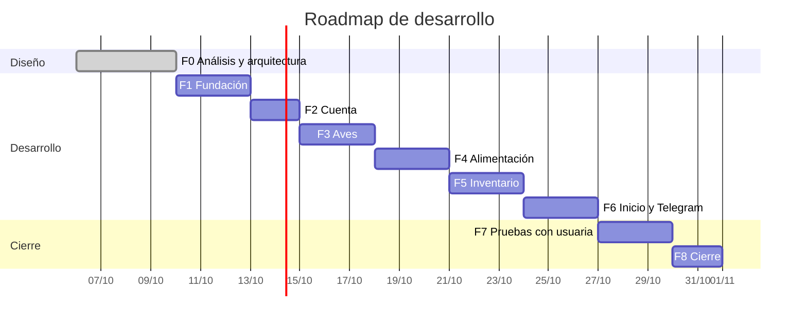

# Roadmap

Fecha límite: app funcionando en Docker Compose el **31 de octubre de 2026**. Sin VPS ni dominio, así que "desplegada" significa el stack corriendo en localhost y accesible desde el celular de Linda por la red local. Cada fase termina con criterios de salida comprobables, y no se pasa a la siguiente sin cumplirlos.

## F0: Análisis y arquitectura (6–9 oct)

Documentos de esta carpeta, DAD v1.2 (diff) y aprobación. **Salida:** aprobación para empezar F1.

## F1: Fundación (10–12 oct)

- Proyecto Next.js con TypeScript estricto, ESLint, Vitest y estructura de carpetas.
- Prisma: esquema completo, migración inicial y seed de `tipo_ave` y `tabla_alimenticia`.
- `docker-compose.yml`, `Dockerfile`, entrypoint y healthcheck `/api/health`. Todo en localhost, sin TLS.
- `env.ts` con zod, `.env.example` completo y `lib/tiempo.ts`.
- Organic importado, fuentes con `next/font`, layout base y los componentes `ui/` mínimos con los ajustes AA (análisis R-5).
- CI: lint, typecheck, tests y build.
- Scripts `backup.sh` y `restore-test.sh`, con una restauración ejecutada.
- `operacion.md` verificado: abrir la app desde el celular por la IP de la LAN.

**Salida:** `docker compose up` deja la app sirviendo una página y la BD migrada y sembrada. CI en verde. Restauración probada. El celular abre la página.

## F2: Cuenta (13–14 oct)

- RF-01, 02, 03, 18, 19 y RNF-13.
- Registro con `REGISTRO_ABIERTO`, login con argon2, cookie firmada, rate limiting, `middleware.ts` y `requerirUsuario()`.
- Ajustes: celular, contraseña y cerrar sesión.
- Script `restablecer-contrasena.ts`.
- Pantallas Login, Registro y Ajustes (parte de cuenta).

**Salida:** CP-01, 02, 03, 13, 22 (rate limit) y 23 (registro cerrado) pasan. Tests de integración del rate limit y del hash.

## F3: Aves (15–17 oct)

- `dominio/edad.ts` con tests de límites.
- RF-04, 05, 06 (con reactivar): diálogo de ave, grupos de Mis aves (4 banners), edad en semanas.
- Ajustes: gestión de horarios (RF-07), con máximo 3, hora única y estados vacío y máximo.

**Salida:** CP-04, 05, 06, 07, 16 y 19 pasan. Los grupos cuadran con la etapa calculada.

## F4: Alimentación (18–20 oct)

- `dominio/alimento.ts` y `horarioParaMostrar`.
- RF-08, 09, 10: pantalla Alimentar con cantidad, etiqueta de horario, confirmación editable e historial.
- Estado "sin horarios" con enlace a Ajustes.

**Salida:** CP-08, 09 y 17 pasan. El cálculo coincide con la hoja de verificación del checklist (ejemplo de 15 aves).

## F5: Inventario y proyección (21–23 oct)

- `dominio/inventario.ts` y `proyeccion15`.
- RF-11, 12, 13, 14: pantalla Inventario, diálogo de compra, historial, proyección con margen y costo.
- Casos límite: sin compras, sin aves, inventario negativo.

**Salida:** CP-10 y CP-11 pasan, con tests de la fórmula incluidos los casos límite.

## F6: Inicio y Telegram (24–26 oct)

- Pantalla Inicio con sus estados.
- Cliente de Telegram, `LongPollingTelegram`, vinculación (RF-17, CP-14) y pantalla de vinculación en Ajustes.
- Planificador, recordatorios con ventana, omisión y reintentos (RF-15, CP-15 y CP-18).
- Alerta de inventario bajo (RF-16, CP-12 y CP-20).
- RF-20 (desvincular) solo si sobra tiempo.

**Salida:** CP-12, 14, 15, 18, 20 y 21 pasan con el bot real. Prueba de reinicio: reiniciar la app dentro de la ventana no duplica el aviso.

## F7: Pruebas con usuaria (27–29 oct)

- Ejecutar los casos de prueba CP-01 a CP-23 del DAD y registrar resultados.
- Sesión con Linda en su celular, por la LAN y con el bot vinculado: tareas guiadas sin ayuda.
- Confirmar los valores de pato de la tabla alimenticia.
- Medición de carga (RNF-02) y revisión de accesibilidad.
- Lista de observaciones priorizada.

**Salida:** informe de pruebas y lista de observaciones. Sin errores bloqueantes abiertos.

## F8: Cierre (30–31 oct)

- Corregir las observaciones priorizadas.
- Cerrar el registro (`REGISTRO_ABIERTO=false`) tras crear la cuenta de Linda.
- Ejecutar de nuevo `restore-test.sh` con datos reales y programar el backup diario.
- Recorrer el [checklist de calidad](checklist-calidad.md) completo.
- Etiquetar `v1.0.0`, y actualizar README y DAD v1.2 (versión final).

**Salida:** app corriendo con `restart: unless-stopped`, backup programado y checklist al 100 %. Linda con cuenta y Telegram vinculado.

## Colchón y recortes

No hay días libres. Si una fase se retrasa, se recorta en este orden: RF-20, pulido visual, tests de integración no críticos. Nunca se recortan F7, el backup ni la restauración probada.
