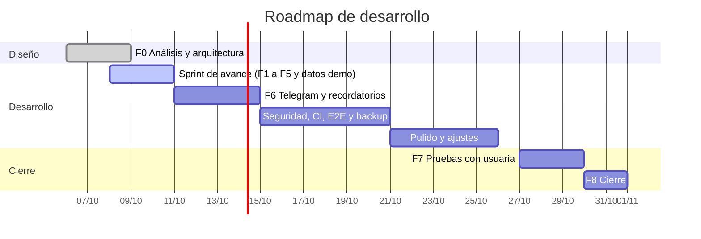

# Roadmap

Fecha límite: app funcionando en Docker Compose el **31 de octubre de 2026**. Sin VPS ni dominio, "desplegada" significa el stack corriendo en Docker Compose en localhost, accesible desde el celular de Linda por la red local.

## F0: Análisis y arquitectura (6 a 9 oct) — hecha

Documentos de esta carpeta y DAD v1.2.

## Sprint de avance (8 al 10 oct)

Entrega del 10/10: avance mostrado en localhost con la vista de celular del inspector del navegador. No hay VPS, ni usuaria final probando, ni Telegram en la demostración.

Orden y slices, con commits pequeños:

1. **Fundación.** Next.js, Prisma, Docker Compose (`app` y `db`), migraciones, seed de `tipo_ave` y `tabla_alimenticia`, tokens de Organic, fuentes con `next/font` y layout mobile-first con la navegación inferior. Sin CI.
2. **Cuenta.** Registro, login, cerrar sesión, cookie firmada, argon2, zod y `REGISTRO_ABIERTO`. Ajustes con celular, contraseña, gestión de horarios (máximo 3, constante) y tabla de referencia con 6 valores.
3. **Mis aves.** 4 banners, ingresar, editar, inactivar y reactivar, con edad y etapa calculadas al vuelo en semanas.
4. **Alimentar.** Cantidad por toma, etiqueta de horario, registro con cantidad editable e historial. Sin horarios activos se pide configurar uno.
5. **Inventario.** Compras, historial, inventario (nunca negativo en pantalla) y proyección a 15 días con margen. Casos borde del DAD 3.5.3.
6. **Inicio.** Aves activas, inventario, días que alcanza, próxima alimentación y tarjeta en estilo de alerta con 3 días o menos.
7. **Datos de demostración.** `npm run seed:demo`: usuaria de prueba, unas 15 aves mezcladas (con pollitos), 3 horarios, 2 compras y varias alimentaciones.

Las pruebas unitarias del cálculo (edad, etapa, cantidad por toma, inventario y proyección) no se recortan. Si algo no cabe, se recorta desde el final de la lista.

**Fuera del sprint** (pasa a las fases siguientes): Telegram, CI, rate limiting, E2E y backup.

**Salida:** `docker compose up` deja la app funcionando con datos de demostración, y las pruebas del cálculo en verde.

## F6: Telegram y recordatorios (11 al 14 oct)

- Cliente de Telegram, `LongPollingTelegram` y vinculación (RF-17) con su sección en Ajustes.
- Planificador, ventana de 10 minutos, omisión de 60 minutos, reintentos y `notificacion_enviada` (RF-15).
- Alerta de inventario bajo (RF-16).
- RF-20 (desvincular) solo se documenta, no se construye.

**Salida:** CP-12, 14, 15, 18, 20 y 21 pasan con el bot real. Reiniciar la app dentro de la ventana no duplica el aviso.

## Seguridad, CI, E2E y backup (15 al 20 oct)

- Rate limiting del login con `intento_login` (RNF-12, CP-22).
- CI en GitHub Actions: lint, typecheck, tests y build.
- Pruebas de integración contra PostgreSQL (acciones, rate limit, planificador).
- E2E mínimo del flujo principal: login, ingresar ave, registrar alimentación y registrar compra.
- `backup.sh` y `restore-test.sh`, con una restauración ejecutada (RNF-14).
- Revisión de accesibilidad y del checklist de calidad hasta ese punto.

**Salida:** CI en verde, restauración probada y CP-22 y CP-23 pasando.

## Pulido y ajustes (21 al 26 oct)

- Estados vacíos, mensajes de error, revisión en el celular real por la IP de la red local.
- Ajustes derivados de la demostración del 10/10.
- Medición de carga (RNF-02).

## F7: Pruebas con usuaria (27 al 29 oct)

- Ejecutar los casos CP-01 a CP-23 y registrar los resultados.
- Sesión con Linda en su celular, por la red local y con el bot vinculado, con tareas guiadas.
- Confirmar los valores de pato de la tabla alimenticia.
- Lista de observaciones priorizada.

**Salida:** informe de pruebas y observaciones. Sin errores bloqueantes abiertos.

## F8: Cierre (30 y 31 oct)

- Corregir las observaciones priorizadas.
- Cerrar el registro (`REGISTRO_ABIERTO=false`) tras crear la cuenta de Linda.
- Repetir `restore-test.sh` con datos reales y programar el backup diario.
- Recorrer el [checklist de calidad](checklist-calidad.md) completo.
- Etiquetar `v1.0.0` y actualizar el README.

**Salida:** app corriendo con `restart: unless-stopped`, backup programado y checklist al 100 %.

## Recortes

Si algo se retrasa, se recorta en este orden: pulido visual, E2E, pruebas de integración no críticas. Nunca se recortan las pruebas del cálculo, F7, el backup ni la restauración probada.
